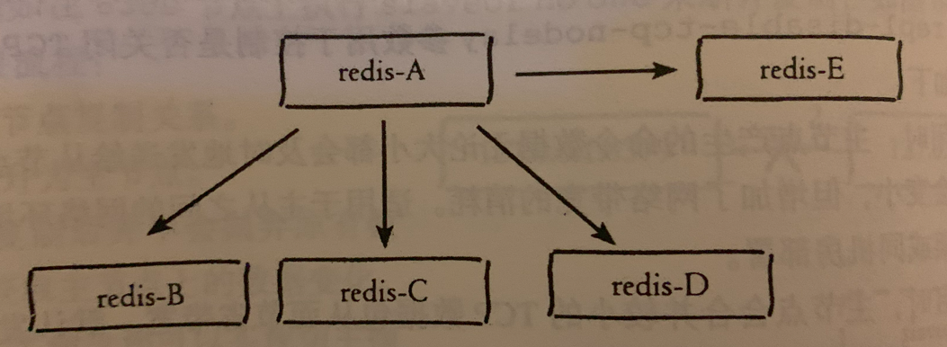
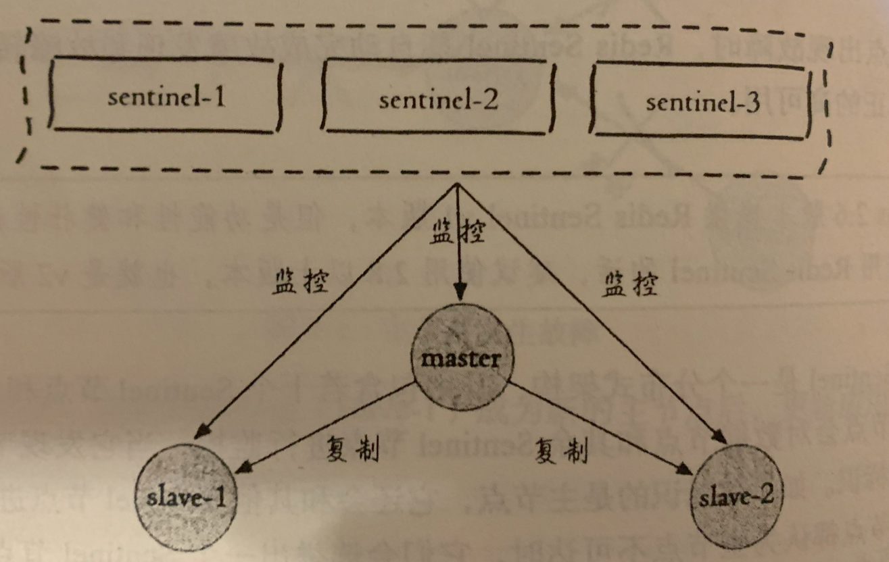
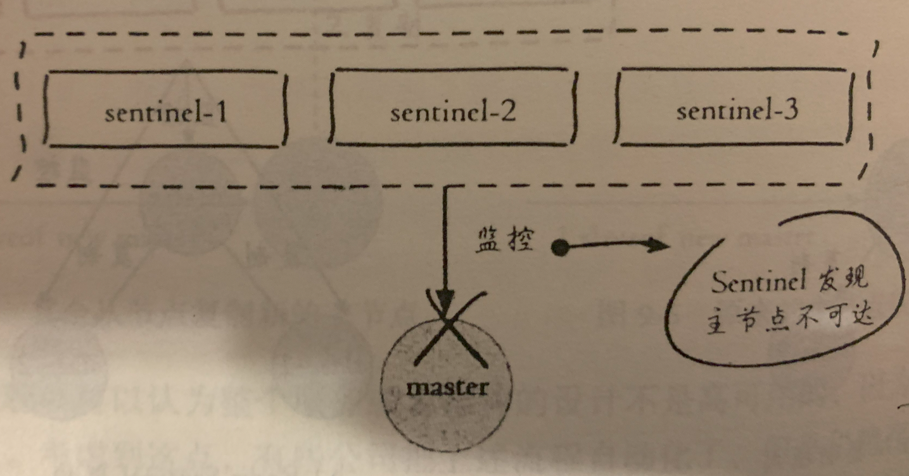
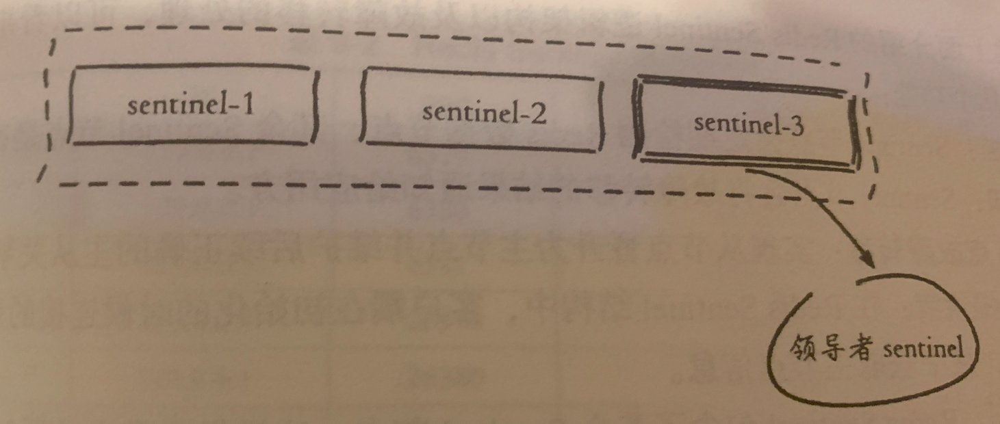
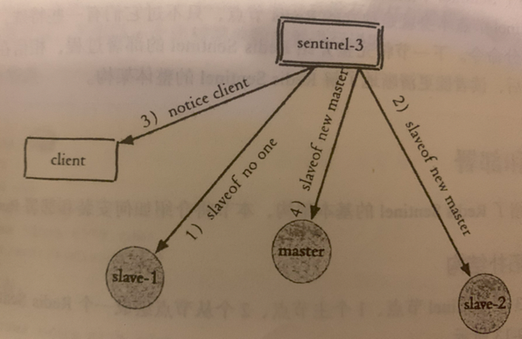
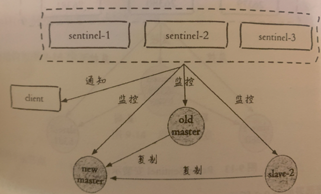
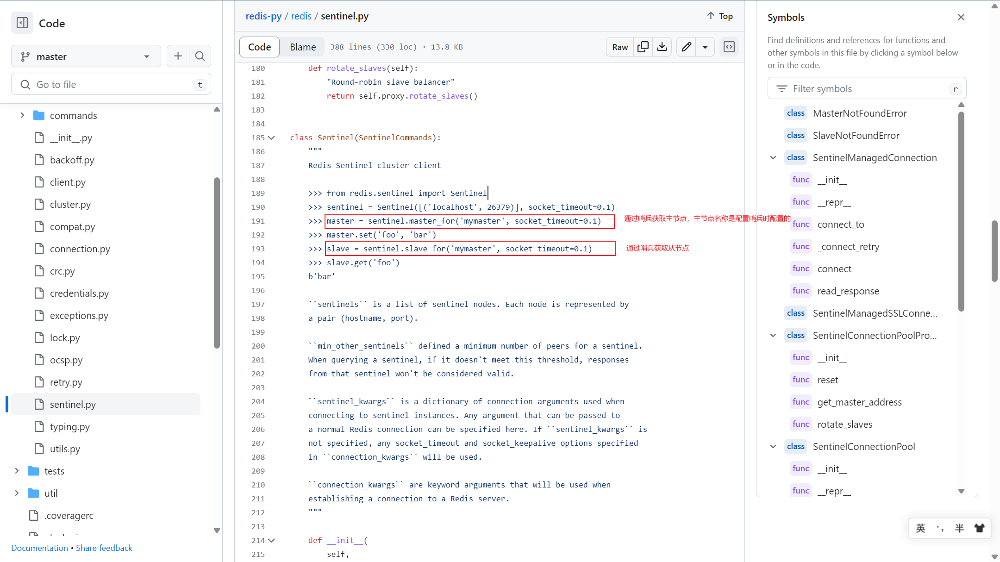

## 一、复制

在分布式系统中，为解决单点问题，一般将数据复制多个副本部署在不同的服务器上，实现故障恢复和负载均衡等需求，Redis本身也提供了这块的功能。


1. 基础介绍

    如何在两台Redis服务上建立起复制呢？我们可以使用

    `slaveof <masterHost> <masterPort>`

    来实现基本的复制功能。通常，我们在建立之后，可以在主、从Redis服务器上执行`info replication`来查看建立的关系信息

    那么，我们又如何断开这种复制功能呢？

    `slaveof no one`

2. 安全性考虑

    Redis服务器务必开启密码进行验证，主节点配置`requirepass`参数值后，从服务器需要配置`masterauth`才可以建立复制关系

3. 只读

    默认情况下，建立主从复制的Redis服务器，主服务器可读可写，但是从只能读取。这是默认配置文件`slave-read-only=yes`在起作用，建议不要修改此参数

4. 一般拓扑结构

    一主一从
    
    

    一主多从

    

    树状主从

    

5. 工作原理

    保存主节点信息

    主动建立Socket连接

    发送ping命令

    权限验证

    同步数据

    命令持续复制

6. 数据同步

    TODO:

7. 主从复制模型搭建（基于docker）

    一主二从结构模型
    
    ```shell
    # docker-compose位置
    # ./src/Redis主从搭建
    # docker-compose up .

    # 主节点6380
    配置 port 6380
    配置 requirepass foobared
    # 从节点6381 这部分的配置一般可以通过启动参数给出，我这里就先写在配置文件中了
    配置 port 6381
    配置 requirepass foobared
    配置 replicaof 127.0.0.1 6380
    配置 masterauth foobared
    # 从节点6382 这部分的配置一般可以通过启动参数给出，我这里就先写在配置文件中了
    配置 port 6382
    配置 requirepass foobared
    配置 replicaof 127.0.0.1 6380
    配置 masterauth foobared
    ```

## 二、哨兵

在复制模型中，一旦主节点噶了，需要人工手动配置新的主节点，同时需要告知应用方，更新了主节点地址，太麻烦了，引入哨兵主要就是为了解决这个问题。

1. 基础介绍

    简单理解，哨兵是在原有复制不变的架构上，添加的监控运维节点。哨兵节点会对主从架构中的每一个节点进行监控（我们配置监控时，只需要配置监控主节点就可以了，主节点上本身保留有从节点信息，哨兵可以读到这部分数据）

    当主节点噶了时，哨兵可以通过定期监控发现主节点噶了，当多个哨兵节点统一认为主节点确实噶了，会选举一个哨兵节点来完成我们上述的一些操作（选举其中一个从节点为主节点，配置其他节点复制这个主节点，同时告知应用方，我们的节点信息发生了变更）

2. 简单的原理图展示

    Redis Sentinel结构

    

    此时主节点噶了

    

    Redis Sentinel选举其中一个哨兵来完成后续的操作

    

    哨兵开始自动配置节点信息

    

    哨兵通知应用方

    

3. 注意

    上述的一切都是Redis的哨兵来完成的，包括通知应用方。那么我们在使用Redis的客户端时，客户端需要特殊处理，通过配置参数来获取我们需要的主从节点，看看redis的python客户端实现

    

4. 哨兵模型搭建（基于docker）

    一主二从三哨兵结构模型

    ```shell
    # docker-compose位置
    # ./src/Redis主从搭建_哨兵
    # docker-compose up .
    # 启动后，我们手动把主节点噶了，将会看到哨兵会主动完成节点的迁移

    # 主节点6380
    配置 port 6380
    配置 requirepass foobared
    # 从节点6381 这部分的配置一般可以通过启动参数给出，我这里就先写在配置文件中了
    配置 port 6381
    配置 requirepass foobared
    配置 replicaof 127.0.0.1 6380
    配置 masterauth foobared
    # 从节点6382 这部分的配置一般可以通过启动参数给出，我这里就先写在配置文件中了
    配置 port 6382
    配置 requirepass foobared
    配置 replicaof 127.0.0.1 6380
    配置 masterauth foobared
    
    # 哨兵1
    配置 port 26380
    配置 sentinel monitor mymaster 127.0.0.1 6380 2
    配置 sentinel auth-pass mymaster foobared
    配置 requirepass "foobared"
    # 哨兵2
    配置 port 26381
    配置 sentinel monitor mymaster 127.0.0.1 6380 2
    配置 sentinel auth-pass mymaster foobared
    配置 requirepass "foobared"
    # 哨兵3
    配置 port 26382
    配置 sentinel monitor mymaster 127.0.0.1 6380 2
    配置 sentinel auth-pass mymaster foobared
    配置 requirepass "foobared"
    ```
