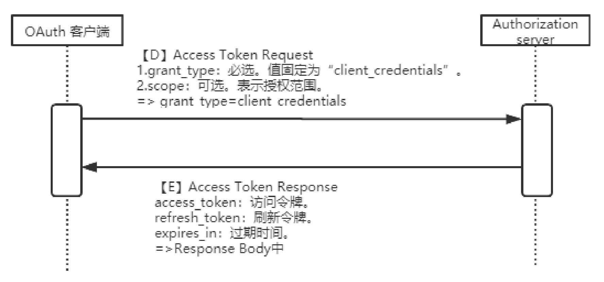

### 1. OAuth2、SSO是什么

> OAuth（Open Authorization，开放授权）是一个开放标准的授权协议，允许用户授权第三方应用访问他们存储在资源服务上受保护的信息，而不需要将用户名和密码提供给第三方应用，解耦了认证和授权。OAuth作为一种国际标准，目前传播广泛并被持续采用。OAuth2.0是OAuth协议的延续版本，更加安全，更易于实现，但不向后兼容OAuth1.0，即完全废止了OAuth1.0。

> 单点登录(SingleSignOn，SSO)，就是通过用户的一次性鉴别登录。当用户在身份认证服务器上登录一次以后，即可获得访问单点登录系统中其他关联系统和应用软件的权限，同时这种实现是不需要管理员对用户的登录状态或其他信息进行修改的，这意味着在多个应用系统中，用户只需一次登录就可以访问所有相互信任的应用系统。

**OAuth结构图**

> Third-party application: 第三方应用，又称"客户端"（client），如上面场景中的门禁系统。
>
> Resource Owner: 资源拥有者，也就是用户。
>
> Http Service: 服务提供商，也就是持有Resource Server的存在方。可以理解为类似微信，钉钉这样具备用户信息的服务者。
> 
> Authorization server: 认证服务器，即服务提供商专门用来处理认证的服务器。
> 
> Resource server: 资源服务器，即服务提供商存放用户生成的资源的服务器。与认证服务器是不同的逻辑节点，但是在物理上，双方是可以在一起的
>
> User Agent: 用户代理，一般就是指的浏览器。
>
> 客户端凭证: Client Id和密码用于认证用户。
>
> 访问令牌: 授权服务提供者在接收到用户请求后,颁发的访问令牌。
>
> 刷新令牌(Refresh Token): 用于获取一个新的令牌。由于令牌的有效期比较短，一旦失效，用户需要再获取令牌的流程是比较繁琐的。为了提升用户体验，可以使用reflesh_token来获取新的令牌。

### 2. OAuth2、SSO有什么区别

OAuth关注的是如何实现A将托管在B的资源授权给C使用，而SSO则关注如何更高效的让A登录B下的多个子系统；

OAuth解决的是服务提供方给第三方应用授权的问题；

而SSO解决的是大型系统中各个子系统如何共享登陆状态的问题。

两者都是基于分布式系统，涉及到多个角色，但是不同的是，OAuth是一种具体的协议，SSO可以说是一种技术，可以用cookie实现，甚至也可以用OAuth实现。

### 3. OAuth四种授权模式

客户端必须得到用户的授权（authorization grant），才能获得令牌（access token）。OAuth 2.0 规定了四种获得令牌的流程，可以选择实际情况选择最适合的一种，向第三方应用颁发令牌。

- 授权码模式（authorization-code）：正宗方式，支持refresh_token
- 简化模式（implicit）: 为web浏览器应用设计，不支持refresh_token
- 密码模式（password）: 为遗留系统设计，支持refresh_token
- 客户端模式（client credentials）为后台api服务设计，不支持refresh_token

不管哪一种授权方式，第三方应用申请令牌之前，都必须先到系统备案，说明自己的身份，然后会拿到两个身份识别码：客户端 ID（client ID 用来标识第三方应用）和客户端密钥（client secret 用来进行安全加密）。这是为了防止令牌被滥用，没有备案过的第三方应用，是不会拿到令牌的。

#### 3.1 授权码模式

这是OAuth2最常用的一种授权许可类型，要求Client具有可公开访问的Server服务器来接受Authorization Code

- 这种模式算是正宗的oauth2的授权模式
- 设计了auth code，通过这个code再获取token
- 支持refresh token

| 优点                                         | 缺点           | 备注       |
| -------------------------------------------- | -------------- | ---------- |
| Access token通过服务器之间进行交换，比较安全 | 请求次数比较多 | 推荐该模式 |

1. 用户登录应用系统，请求跳转到认证服务器，并302返回登录认证页面；
2. 用户输入账户+密码进行认证，认证服务器认证通过返回code给应用系统；
3. 应用系统携带code向认证服务器换取访问令牌，认证服务器验证Client ID，code等信息，给应用系统发送访问令牌；
4. 应用系统携带访问令牌查询用户登录信息，认证服务器返回用户信息，如用户名；
5. 应用系统验证用户名正确，创建会话，并跳转到redirect url。

#### 3.2 简化模式

省略掉了颁发授权码（Authorization Code）给客户端的过程，直接返回访问令牌和可选的刷新令牌。其适用于没有Server服务器来接受处理Authorization Code的第三方应用

| 优点                 | 缺点                                                         | 备注                       |
| -------------------- | ------------------------------------------------------------ | -------------------------- |
| 请求次数比较少，简单 | 1.没有获取code的过程， Access token直接从授权服务器返回给client客户端，令牌容易因为被拦截窃听而泄露2.无法存储refresh token，不支持刷新令牌： 要么access token有效性给很长 要么access token过期后，让用户重新认证 | 适用于公开的浏览器单页应用 |

#### 3.3 密码模式

这种模式再一步简化，和Authorzation Code类型下重要的区分就是省略了Authorization Request和Authorization Response。而是Client直接使用Resource owner提供的username和password来直接请求access_token（直接发起Access Token Request然后返回Access Token Response信息）。这种模式一般适用于Resource server高度信任第三方Client的情况下

| 优点                 | 缺点                                                         | 备注                                                         |
| -------------------- | ------------------------------------------------------------ | ------------------------------------------------------------ |
| 请求次数比较少，简单 | 1.Client会获得用户的登录信息，除非是非常信任的应用，否则可能导致登录信息泄露。2.没有多因子认证这样的机制 | 可以用来做遗留项目升级为oauth2的适配方案Client是自家应用的场景 |

#### 3.4 客户端模式

Client直接已自己的名义而不是Resource owner的名义去要求访问Resource server的一些受保护资源

- 适用于服务器间通信场景，直接根据client的id和密钥即可获取token，无需用户参与
- 这种模式比较合适消费api的后端服务，比如拉取一组用户信息等
- 不支持refresh token

Refresh token的初衷主要是为了用户体验不想用户重复输入账号密码来换取新token，因而设计了refresh token用于换取新token，客户端模式由于没有用户参与，而且也不需要用户账号密码，仅仅根据自己的id和密钥就可以换取新token，因而没必要refresh token.

### 4. 更多资料

- [阮一峰大佬-理解OAuth 2.0](https://www.ruanyifeng.com/blog/2014/05/oauth_2_0.html)
- [阮一峰大佬-OAuth 2.0 的四种方式](https://www.ruanyifeng.com/blog/2019/04/oauth-grant-types.html)
- [笔者觉得最好的oauth的例子-微博授权](https://open.weibo.com/wiki/%E6%8E%88%E6%9D%83%E6%9C%BA%E5%88%B6)
- [知乎-sso是什么, 如何实现](https://www.zhihu.com/question/57686811)
- [知乎-现在用的比较多的单点登录技术是什么？](https://www.zhihu.com/question/342103776/answer/798611224)
- [笔者自己写的一个demo【警告:真的就是demo, 之前练手的代码，请大佬们高抬贵手】](https://github.com/Bean-jun/AuthSystem.git)