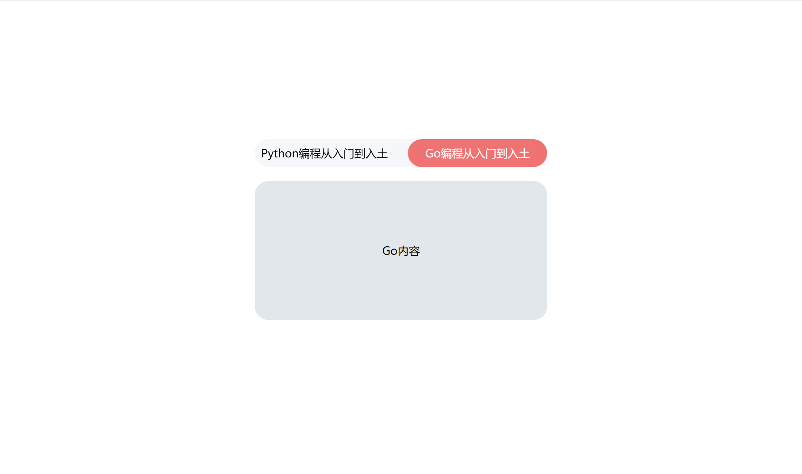
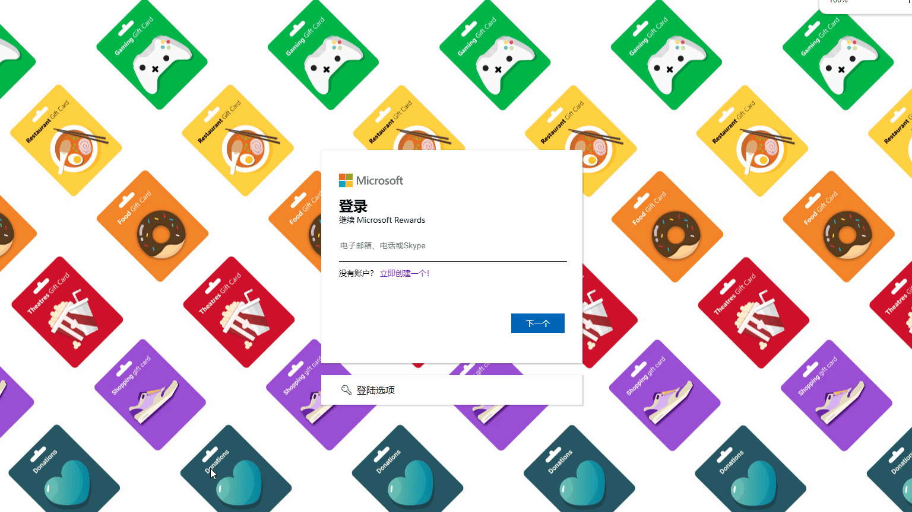

### 说明

此文档用于记录本人使用前端三件套实现基础的交互，主要用于练习

1. [01-标签栏切换.html](./src/01-标签栏切换.html)

    通过点击上方栏目实现动画切换效果，同时下方内容进行简单的切换

    

2. [02-标签栏切换-js版.html](./src/02-标签栏切换-js版.html)

    通过点击上方栏目实现动画切换效果（再第一版的基础上使用js控制animation偏移），同时下方内容进行简单的切换

    

3. [03-微软登陆页面.html](./src/03-微软登陆页面.html)

    微软登录页动效

    

4. [04-微软登陆页面-支持下一步版.html](./src/04-微软登陆页面-支持下一步版.html)

    微软登录页动效

    
