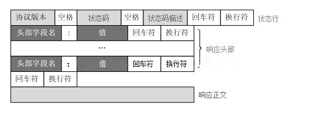
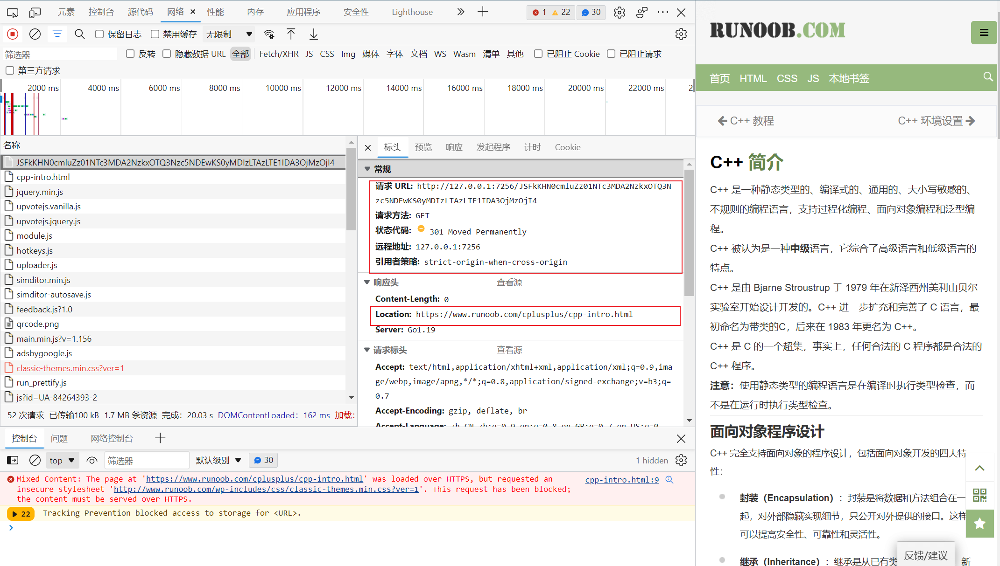

### 一、tcp通信

1. server端

```go
package main

import (
	"log"
	"net"
)

var (
	Port = ":7256"
)

func main() {
	// 监听端口
	listen, err := net.Listen("tcp", Port)
	if err != nil {
		log.Println("create listen error ", err.Error())
	}
	for {
		// 等待获取一个连接对象
		conn, err := listen.Accept()
		if err != nil {
			log.Println("create conn error", err.Error())
		}
		// 基于协程进行当前连接对象的处理
		go handle(conn)
	}
}

func handle(conn net.Conn) {
	defer conn.Close()
	for {
		data := make([]byte, 1024)
		// 读取数据
		n, err := conn.Read(data)
		if err != nil {
			log.Println(err.Error())
			return
		}
		from_addr := conn.RemoteAddr().String()
		log.Println(from_addr, "read bytes:", n, "read data:", string(data))
		// 发送数据
		conn.Write(data)
	}
}
```

2. client端

```go
package main

import (
	"fmt"
	"log"
	"net"
)

var (
	Port = ":7256"
)

func main() {
	// 对服务端进行连接
	conn, err := net.Dial("tcp", Port)
	if err != nil {
		log.Println("create conn error", err.Error())
	}
	defer conn.Close()
	for {
		var sendData string
		_, err := fmt.Scan(&sendData)
		if err != nil {
			log.Println(err.Error())
			return
		}
		// 向服务端发送消息
		conn.Write([]byte(sendData))
		for {
			recvData := make([]byte, 1024)
			n, err := conn.Read(recvData)
			if err != nil {
				log.Println(err.Error())
				break
			}
			server_addr := conn.RemoteAddr().String()
			log.Println(server_addr, "read bytes:", n, "read data:", string(recvData))
			break
		}
	}
}
```


```python
import socket

# tcp
sk = socket.socket(socket.AF_INET, socket.SOCK_STREAM)
sk.connect(("127.0.0.1", 7256))

while True:
    to = input(">>>:")
    sk.send(to.encode())
    while True:
        msg = sk.recv(1024)
        body = msg.decode()
        if body:
            print("recv:", body)
        break
```

### 二、http协议

> http协议介绍[click me](https://developer.mozilla.org/zh-CN/docs/Web/HTTP/Overview)
> 
> 当客户端想要和服务端进行信息交互时（服务端是指最终服务器，或者是一个中间代理），过程表现为下面几步：
> 1. 打开一个 TCP 连接：TCP 连接被用来发送一条或多条请求，以及接受响应消息。客户端可能打开一条新的连接，或重用一个已经存在的连接，或者也可能开几个新的 TCP 连接连向服务端。
> 2. 发送一个 HTTP 报文：HTTP 报文（在 HTTP/2 之前）是语义可读的。在 HTTP/2 中，这些简单的消息被封装在了帧中，这使得报文不能被直接读取，但是原理仍是相同的。

```http
GET / HTTP/1.1
Host: developer.mozilla.org
Accept-Language: fr
```
> 3. 读取服务端返回的报文信息：

```http
HTTP/1.1 200 OK
Date: Sat, 09 Oct 2010 14:28:02 GMT
Server: Apache
Last-Modified: Tue, 01 Dec 2009 20:18:22 GMT
ETag: "51142bc1-7449-479b075b2891b"
Accept-Ranges: bytes
Content-Length: 29769
Content-Type: text/html

<!DOCTYPE html... (here comes the 29769 bytes of the requested web page)
```

> 4. 关闭连接或者为后续请求重用连接。
> 

> http请求头格式
>
> 

> http响应头格式
>
> 

### 三、http实现

1. socket读取请求数据流

```go
package main

import (
	"log"
	"net"
	"time"
)

var (
	Port           = ":7256"
	MaxHeaderSize  = 1 << 10
	ReadHeaderSize = 1 << 8
)

func main() {
	// 监听端口
	listen, err := net.Listen("tcp", Port)
	if err != nil {
		log.Println("create listen error ", err.Error())
	}
	for {
		// 等待获取一个连接对象
		conn, err := listen.Accept()
		if err != nil {
			log.Println("create conn error", err.Error())
		}
		// 基于协程进行当前连接对象的处理
		go handle(conn)
	}
}

func handle(conn net.Conn) {
	defer conn.Close()
	start := time.Now()
	header := make([]byte, 0, MaxHeaderSize)
	for {
		headerRead := make([]byte, ReadHeaderSize)
		n, err := conn.Read(headerRead)
		if err != nil {
			return
		}

		header = append(header, headerRead...)
		log.Println("read data value length: ", n)
		if n < ReadHeaderSize {
			break
		}
	}
	log.Println("use time total: ", time.Since(start), "read data:\n", string(header))
}
```

2. 解析请求头

```go
// ReqHeaderLine 请求头首行
type ReqHeaderLine struct {
    Method   string
    Url      string
    Protocol string
}

// ReqHeaderBody 请求头body
type ReqHeaderBody struct {
    Body map[string]interface{}
}

// ReqHeader 请求头
type ReqHeader struct {
    ReqHeaderLine
    ReqHeaderBody
}

// ParseHttpRequestFirstLine 解析请求头首行
func ParseHttpRequestFirstLine(line []byte) *ReqHeaderLine {
	re := regexp.MustCompile(`([A-Z]+)\s(/.*)\s(HTTP/1.[0-1]+)$`)
	matched := re.FindStringSubmatch(string(line))
	if len(matched) != 4 {
		panic(errors.New("parse request header error"))
	}
	return &ReqHeaderLine{
		Method:   matched[1],
		Url:      matched[2],
		Protocol: matched[3],
	}
}

// ParseHttpRequestLine 解析请求头
func ParseHttpRequestLine(lines ...[]byte) *ReqHeaderBody {
	var body = map[string]interface{}{}
	for _, line := range lines {
		lineSlice := strings.Split(string(line), ": ")
		body[lineSlice[0]] = lineSlice[1]
	}
	return &ReqHeaderBody{
		Body: body,
	}
}

// ParseHttpHeader 解析请求头
func ParseHttpHeader(reqData []byte) *ReqHeader {
	reqHeaderWithBody := bytes.Split(reqData, []byte("\r\n\r\n"))
	reqHeader := bytes.Split(reqHeaderWithBody[0], []byte("\r\n"))
	if len(reqHeader) < 1 {
		panic(errors.New("request header parse error"))
	}
	return &ReqHeader{
		ReqHeaderLine: *ParseHttpRequestFirstLine(reqHeader[0]),
		ReqHeaderBody: *ParseHttpRequestLine(reqHeader[1:]...),
	}
}
```

3. 返回响应体

```go
// RespHeaderLine 响应头首行
type RespHeaderLine struct {
	Protocol string
	Code     int
	Desc     string
}

// RespHeaderBody 响应头body
type RespHeaderBody struct {
	Body map[string]interface{}
}

// RespHeader 响应头
type RespHeader struct {
	RespHeaderLine
	RespHeaderBody
}

// InitHttpResponseHeader 写入响应头
func InitHttpResponseHeader(r *ReqHeader) *RespHeader {
    return &RespHeader{
        RespHeaderLine{Protocol: r.Protocol},
        RespHeaderBody{map[string]interface{}{
			"Server": "Go1.19",
		}},
    }
}

// SetResponseHeader 设置响应头
func SetResponseHeader(resp *RespHeader, code int) *RespHeader {
    resp.Code = HttpStatusCodeMap[code].Code
    resp.Desc = HttpStatusCodeMap[code].Desc
    return resp
}

// ResponseToString 响应转string
func ResponseToString(r *RespHeader, body string) *strings.Builder {
    // 设置响应体长度
    r.Body["Content-Length"] = strconv.Itoa(len(body))
    
    header := &strings.Builder{}
    header.WriteString(fmt.Sprintf("%s %d %s\r\n", r.Protocol, r.Code, r.Desc))
    for k, v := range r.Body {
    header.WriteString(fmt.Sprintf("%s: %s\r\n", k, v.(string)))
    }
    header.WriteString("\r\n")
    header.WriteString(body)
    return header
}
```

4. 完整实现

```go
package main

import (
	"bytes"
	"errors"
	"fmt"
	"log"
	"net"
	"regexp"
	"strconv"
	"strings"
	"time"
)

var (
	Port              = ":7256"
	MaxHeaderSize     = 1 << 10
	ReadHeaderSize    = 1 << 8
	HttpStatusCodeMap = HttpStatusMap{
		100: HttpStatus{Code: 100, Desc: "Continue"},
		200: HttpStatus{Code: 200, Desc: "OK"},
		301: HttpStatus{Code: 301, Desc: "Moved Permanently"},
		400: HttpStatus{Code: 400, Desc: "Bad Request"},
		403: HttpStatus{Code: 403, Desc: "Forbidden"},
		404: HttpStatus{Code: 404, Desc: "Not Found"},
		405: HttpStatus{Code: 405, Desc: "Method Not Allowed"},
		500: HttpStatus{Code: 500, Desc: "Internal Server Error"},
		502: HttpStatus{Code: 502, Desc: "Bad Gateway"},
	}
)

// ReqHeaderLine 请求头首行
type ReqHeaderLine struct {
	Method   string
	Url      string
	Protocol string
}

// ReqHeaderBody 请求头body
type ReqHeaderBody struct {
	Body map[string]interface{}
}

// ReqHeader 请求头
type ReqHeader struct {
	ReqHeaderLine
	ReqHeaderBody
}

// RespHeaderLine 响应头首行
type RespHeaderLine struct {
	Protocol string
	Code     int
	Desc     string
}

// RespHeaderBody 响应头body
type RespHeaderBody struct {
	Body map[string]interface{}
}

// RespHeader 响应头
type RespHeader struct {
	RespHeaderLine
	RespHeaderBody
}

// HttpStatus http状态码
type HttpStatus struct {
	Code int
	Desc string
}

// HttpStatusMap http状态码集合
type HttpStatusMap map[int]HttpStatus

func main() {
	// 监听端口
	listen, err := net.Listen("tcp", Port)
	if err != nil {
		log.Println("create listen error ", err.Error())
	}
	for {
		// 等待获取一个连接对象
		conn, err := listen.Accept()
		if err != nil {
			log.Println("create conn error", err.Error())
		}
		// 基于协程进行当前连接对象的处理
		go Handle(conn)
	}
}

func Handle(conn net.Conn) {
	defer conn.Close()
	start := time.Now()
	header := make([]byte, 0, MaxHeaderSize)
	for {
		headerRead := make([]byte, ReadHeaderSize)
		n, err := conn.Read(headerRead)
		if err != nil {
			return
		}

		header = append(header, headerRead...)
		log.Println("read data value length: ", n)
		if n < ReadHeaderSize {
			break
		}
	}
	log.Println("use time total: ", time.Since(start))
	// 解析请求头
	headers := ParseHttpHeader(header)
	// 写入响应头
	responseHeader := InitHttpResponseHeader(headers)
	// 设置响应头状态码
	responseHeader = SetResponseHeader(responseHeader, 200)
	// 拼装响应头
	responseBody := ResponseToString(responseHeader, "hello world")
	// 设置响应体
	n, err := conn.Write([]byte(responseBody.String()))
	if err != nil {
		return
	}
	log.Println("http headers:", n)
}

// ParseHttpRequestFirstLine 解析请求头首行
func ParseHttpRequestFirstLine(line []byte) *ReqHeaderLine {
	re := regexp.MustCompile(`([A-Z]+)\s(/.*)\s(HTTP/1.[0-1]+)$`)
	matched := re.FindStringSubmatch(string(line))
	if len(matched) != 4 {
		panic(errors.New("parse request header error"))
	}
	return &ReqHeaderLine{
		Method:   matched[1],
		Url:      matched[2],
		Protocol: matched[3],
	}
}

// ParseHttpRequestLine 解析请求头
func ParseHttpRequestLine(lines ...[]byte) *ReqHeaderBody {
	var body = map[string]interface{}{}
	for _, line := range lines {
		lineSlice := strings.Split(string(line), ": ")
		body[lineSlice[0]] = lineSlice[1]
	}
	return &ReqHeaderBody{
		Body: body,
	}
}

// ParseHttpHeader 解析请求头
func ParseHttpHeader(reqData []byte) *ReqHeader {
	reqHeaderWithBody := bytes.Split(reqData, []byte("\r\n\r\n"))
	reqHeader := bytes.Split(reqHeaderWithBody[0], []byte("\r\n"))
	if len(reqHeader) < 1 {
		panic(errors.New("request header parse error"))
	}
	return &ReqHeader{
		ReqHeaderLine: *ParseHttpRequestFirstLine(reqHeader[0]),
		ReqHeaderBody: *ParseHttpRequestLine(reqHeader[1:]...),
	}
}

// InitHttpResponseHeader 写入响应头
func InitHttpResponseHeader(r *ReqHeader) *RespHeader {
	return &RespHeader{
		RespHeaderLine{Protocol: r.Protocol},
		RespHeaderBody{map[string]interface{}{
			"Server": "Go1.19",
		}},
	}
}

// SetResponseHeader 设置响应头
func SetResponseHeader(resp *RespHeader, code int) *RespHeader {
	resp.Code = HttpStatusCodeMap[code].Code
	resp.Desc = HttpStatusCodeMap[code].Desc
	return resp
}

// ResponseToString 响应转string
func ResponseToString(r *RespHeader, body string) *strings.Builder {
	// 设置响应体长度
	r.Body["Content-Length"] = strconv.Itoa(len(body))

	header := &strings.Builder{}
	header.WriteString(fmt.Sprintf("%s %d %s\r\n", r.Protocol, r.Code, r.Desc))
	for k, v := range r.Body {
		header.WriteString(fmt.Sprintf("%s: %s\r\n", k, v.(string)))
	}
	header.WriteString("\r\n")
	header.WriteString(body)
	return header
}
```

### 四、手搓URL重定向功能

1. 简易实现

效果图:


代码:
```go
package main

import (
	"bytes"
	"encoding/base64"
	"errors"
	"fmt"
	"log"
	"math/rand"
	"net"
	"net/url"
	"regexp"
	"strconv"
	"strings"
	"sync"
	"time"
)

var (
	Schema         = "http"
	Host           = "127.0.0.1"
	Port           = ":7256"
	MaxHeaderSize  = 1 << 10
	ReadHeaderSize = 1 << 8
	IndexHtml      = "<!DOCTYPE html>\n<html lang=\"en\">\n<head>\n    <meta charset=\"UTF-8\">\n    <title>短连接生成器</title>\n</head>\n<body>\n<form action=\"/\" method=\"post\">\n    <label>\n        <input type=\"text\" name=\"url\"/>\n    </label>\n    <input type=\"submit\" value=\"提交\">\n</form>\n</body>\n</html>"
	PathUnescape   = url.PathUnescape
	UrlMap         = struct {
		L   sync.RWMutex
		Url map[string]string
	}{
		Url: map[string]string{},
	}
	HttpStatusCodeMap = HttpStatusMap{
		100: HttpStatus{Code: 100, Desc: "Continue"},
		200: HttpStatus{Code: 200, Desc: "OK"},
		301: HttpStatus{Code: 301, Desc: "Moved Permanently"},
		400: HttpStatus{Code: 400, Desc: "Bad Request"},
		403: HttpStatus{Code: 403, Desc: "Forbidden"},
		404: HttpStatus{Code: 404, Desc: "Not Found"},
		405: HttpStatus{Code: 405, Desc: "Method Not Allowed"},
		500: HttpStatus{Code: 500, Desc: "Internal Server Error"},
		502: HttpStatus{Code: 502, Desc: "Bad Gateway"},
	}
)

// UrlGet 获取Url
func UrlGet(key string) string {
	UrlMap.L.RLock()
	defer UrlMap.L.RUnlock()
	if value, ok := UrlMap.Url[key]; !ok {
		return ""
	} else {
		return value
	}
}

// UrlSet 设置Url
func UrlSet(key, value string) bool {
	if _, ok := UrlMap.Url[key]; ok {
		return false
	}
	UrlMap.L.Lock()
	defer UrlMap.L.Unlock()
	if !strings.HasPrefix(value, "http") {
		value = "http://" + value
	}
	UrlMap.Url[key] = value
	return true
}

// ReqHeaderLine 请求头首行
type ReqHeaderLine struct {
	Method   string
	Url      string
	Protocol string
}

// ReqHeaderBody 请求头body
type ReqHeaderBody struct {
	Body map[string]interface{}
}

// ReqHeader 请求头
type ReqHeader struct {
	ReqHeaderLine
	ReqHeaderBody
}

// RespHeaderLine 响应头首行
type RespHeaderLine struct {
	Protocol string
	Code     int
	Desc     string
}

// RespHeaderBody 响应头body
type RespHeaderBody struct {
	Body map[string]interface{}
}

// RespHeader 响应头
type RespHeader struct {
	RespHeaderLine
	RespHeaderBody
}

// HttpStatus http状态码
type HttpStatus struct {
	Code int
	Desc string
}

// HttpStatusMap http状态码集合
type HttpStatusMap map[int]HttpStatus

func main() {
	// 监听端口
	listen, err := net.Listen("tcp", Port)
	if err != nil {
		log.Println("create listen error ", err.Error())
	}
	for {
		// 等待获取一个连接对象
		conn, err := listen.Accept()
		if err != nil {
			log.Println("create conn error", err.Error())
		}
		// 基于协程进行当前连接对象的处理
		go Handle(conn)
	}
}

func Handle(conn net.Conn) {
	start := time.Now()
	header := make([]byte, 0, MaxHeaderSize)
	for {
		headerRead := make([]byte, ReadHeaderSize)
		n, err := conn.Read(headerRead)
		if err != nil {
			return
		}

		header = append(header, headerRead...)
		log.Println("read data value length: ", n)
		if n < ReadHeaderSize {
			break
		}
	}
	log.Println("use time total: ", time.Since(start))
	// 解析请求头
	headers, body := ParseHttpHeader(header)

	err, m := ParseRequestBody(headers, body)

	log.Println(m, err)

	switch headers.Method {
	case "GET":
		DoGet(headers, nil, conn)
	case "POST":
		DoPost(headers, m, conn)
	default:
		Abort(headers, conn)
	}
}

// ParseHttpRequestFirstLine 解析请求头首行
func ParseHttpRequestFirstLine(line []byte) *ReqHeaderLine {
	re := regexp.MustCompile(`([A-Z]+)\s(/.*)\s(HTTP/1.[0-1]+)$`)
	matched := re.FindStringSubmatch(string(line))
	if len(matched) != 4 {
		panic(errors.New("parse request header error"))
	}
	return &ReqHeaderLine{
		Method:   matched[1],
		Url:      matched[2],
		Protocol: matched[3],
	}
}

// ParseHttpRequestLine 解析请求头
func ParseHttpRequestLine(lines ...[]byte) *ReqHeaderBody {
	var body = map[string]interface{}{}
	for _, line := range lines {
		lineSlice := strings.Split(string(line), ": ")
		body[lineSlice[0]] = lineSlice[1]
	}
	return &ReqHeaderBody{
		Body: body,
	}
}

// ParseHttpHeader 解析请求头
func ParseHttpHeader(reqData []byte) (*ReqHeader, []byte) {
	reqHeaderWithBody := bytes.Split(reqData, []byte("\r\n\r\n"))
	reqHeader := bytes.Split(reqHeaderWithBody[0], []byte("\r\n"))
	if len(reqHeader) < 1 {
		panic(errors.New("request header parse error"))
	}
	return &ReqHeader{
		ReqHeaderLine: *ParseHttpRequestFirstLine(reqHeader[0]),
		ReqHeaderBody: *ParseHttpRequestLine(reqHeader[1:]...),
	}, reqHeaderWithBody[1]
}

// InitHttpResponseHeader 写入响应头
func InitHttpResponseHeader(r *ReqHeader) *RespHeader {
	return &RespHeader{
		RespHeaderLine{Protocol: r.Protocol},
		RespHeaderBody{map[string]interface{}{
			"Server": "Go1.19",
		}},
	}
}

// SetResponseHeaderCode 设置响应头
func SetResponseHeaderCode(resp *RespHeader, code int) *RespHeader {
	resp.Code = HttpStatusCodeMap[code].Code
	resp.Desc = HttpStatusCodeMap[code].Desc
	return resp
}

// ResponseToString 响应转string
func ResponseToString(r *RespHeader, body string) *strings.Builder {
	// 设置响应体长度
	r.Body["Content-Length"] = strconv.Itoa(len(body))

	header := &strings.Builder{}
	header.WriteString(fmt.Sprintf("%s %d %s\r\n", r.Protocol, r.Code, r.Desc))
	for k, v := range r.Body {
		header.WriteString(fmt.Sprintf("%s: %s\r\n", k, v.(string)))
	}
	header.WriteString("\r\n")
	header.WriteString(body)
	return header
}

// ParseFormUrlencoded application/x-www-form-urlencoded
func ParseFormUrlencoded(bodyStr string) map[string]string {
	bodyStrSlice := strings.Split(bodyStr, "&")
	bodyMap := map[string]string{}
	for _, bodykv := range bodyStrSlice {
		kvSlice := strings.Split(bodykv, "=")
		if len(kvSlice) >= 2 {
			bodyMap[kvSlice[0]] = kvSlice[1]
		} else {
			bodyMap[kvSlice[0]] = ""
		}
	}
	return bodyMap
}

// ParseRequestBody 解析请求体
func ParseRequestBody(r *ReqHeader, body []byte) (error, map[string]string) {
	value := 0
	if v, ok := r.Body["Content-Length"]; !ok {
		return errors.New("error"), nil
	} else {
		value, _ = strconv.Atoi(v.(string))
	}
	bodyStr := string(body[:value])

	if cType, ok := r.Body["Content-Type"]; !ok {
		return errors.New("error Content-Type"), nil
	} else {
		//application/x-www-form-urlencoded
		if cType == "application/x-www-form-urlencoded" {
			return nil, ParseFormUrlencoded(bodyStr)
		}
	}
	return nil, nil
}

// GenerateRandomKey 生成一个随机key
func GenerateRandomKey() string {
	key := fmt.Sprintf("%s-%s", strconv.Itoa(rand.Int()), time.Now().Format("2006-01-02 15:04:05"))
	return base64.StdEncoding.EncodeToString([]byte(key))
}

// GetRequestUrlPath 获取请求路径
func GetRequestUrlPath(r *ReqHeader) string {
	return r.Url
}

func DoGet(headers *ReqHeader, body map[string]string, conn net.Conn) {
	defer conn.Close()
	responseHeader := InitHttpResponseHeader(headers)
	responseHeader = SetResponseHeaderCode(responseHeader, 200)
	var responseBody *strings.Builder

	redirectKey := GetRequestUrlPath(headers)
	// 返回首页
	if redirectKey == "/" {
		responseBody = ResponseToString(responseHeader, IndexHtml)
	} else {
		redirectValue := UrlGet(strings.Trim(redirectKey, "/"))
		responseHeader.Body["Location"] = redirectValue
		responseHeader = SetResponseHeaderCode(responseHeader, 301)
		responseBody = ResponseToString(responseHeader, "")
	}
	_, err := conn.Write([]byte(responseBody.String()))
	if err != nil {
		return
	}
}

func DoPost(headers *ReqHeader, body map[string]string, conn net.Conn) {
	defer conn.Close()
	responseHeader := InitHttpResponseHeader(headers)
	responseHeader.Body["Content-Type"] = "text/html;charset=utf-8"
	responseHeader = SetResponseHeaderCode(responseHeader, 200)
	var responseBody *strings.Builder

	if v, ok := body["url"]; !ok {
		responseHeader = SetResponseHeaderCode(responseHeader, 400)
		responseBody = ResponseToString(responseHeader, "地址填写异常")
	} else {
		key := GenerateRandomKey()
		pathUnescape, err := PathUnescape(v)
		if err != nil {
			panic(err)
		}
		status := UrlSet(key, pathUnescape)
		if !status {
			responseBody = ResponseToString(responseHeader, "地址配置重复")
		} else {
			respKey := fmt.Sprintf("%s://%s%s/%s", Schema, Host, Port, key)
			responseBody = ResponseToString(responseHeader, respKey)
		}
	}
	_, err := conn.Write([]byte(responseBody.String()))
	if err != nil {
		return
	}
}

// Abort 网站异常
func Abort(headers *ReqHeader, conn net.Conn) {
	defer conn.Close()
	// 写入响应头
	responseHeader := InitHttpResponseHeader(headers)
	responseHeader = SetResponseHeaderCode(responseHeader, 400)
	// 拼装响应头
	responseBody := ResponseToString(responseHeader, "")
	// 设置响应体
	_, err := conn.Write([]byte(responseBody.String()))
	if err != nil {
		return
	}
}
```

2. 使用文件支持连接持久化

```go
package main

import (
	"bytes"
	"encoding/base64"
	"encoding/json"
	"errors"
	"fmt"
	"log"
	"math/rand"
	"net"
	"net/url"
	"os"
	"regexp"
	"strconv"
	"strings"
	"sync"
	"time"
)

var (
	Schema         = "http"
	Host           = "127.0.0.1"
	Port           = ":7256"
	MaxHeaderSize  = 1 << 10
	ReadHeaderSize = 1 << 8
	IndexHtml      = "<!DOCTYPE html>\n<html lang=\"en\">\n<head>\n    <meta charset=\"UTF-8\">\n    <title>短连接生成器</title>\n</head>\n<body>\n<form action=\"/\" method=\"post\">\n    <label>\n        <input type=\"text\" name=\"url\"/>\n    </label>\n    <input type=\"submit\" value=\"提交\">\n</form>\n</body>\n</html>"
	PathUnescape   = url.PathUnescape
	LocalDB        = "short.json"
	UrlMap         = struct {
		L   sync.RWMutex
		Url map[string]string
	}{
		Url: map[string]string{},
	}
	HttpStatusCodeMap = HttpStatusMap{
		100: HttpStatus{Code: 100, Desc: "Continue"},
		200: HttpStatus{Code: 200, Desc: "OK"},
		301: HttpStatus{Code: 301, Desc: "Moved Permanently"},
		400: HttpStatus{Code: 400, Desc: "Bad Request"},
		403: HttpStatus{Code: 403, Desc: "Forbidden"},
		404: HttpStatus{Code: 404, Desc: "Not Found"},
		405: HttpStatus{Code: 405, Desc: "Method Not Allowed"},
		500: HttpStatus{Code: 500, Desc: "Internal Server Error"},
		502: HttpStatus{Code: 502, Desc: "Bad Gateway"},
	}
)

// UrlGet 获取Url
func UrlGet(key string) string {
	UrlMap.L.RLock()
	defer UrlMap.L.RUnlock()
	if value, ok := UrlMap.Url[key]; !ok {
		return ""
	} else {
		return value
	}
}

// UrlSet 设置Url
func UrlSet(key, value string) bool {
	if _, ok := UrlMap.Url[key]; ok {
		return false
	}
	UrlMap.L.Lock()
	defer UrlMap.L.Unlock()
	if !strings.HasPrefix(value, "http") {
		value = "http://" + value
	}
	UrlMap.Url[key] = value
	return true
}

// ReqHeaderLine 请求头首行
type ReqHeaderLine struct {
	Method   string
	Url      string
	Protocol string
}

// ReqHeaderBody 请求头body
type ReqHeaderBody struct {
	Body map[string]interface{}
}

// ReqHeader 请求头
type ReqHeader struct {
	ReqHeaderLine
	ReqHeaderBody
}

// RespHeaderLine 响应头首行
type RespHeaderLine struct {
	Protocol string
	Code     int
	Desc     string
}

// RespHeaderBody 响应头body
type RespHeaderBody struct {
	Body map[string]interface{}
}

// RespHeader 响应头
type RespHeader struct {
	RespHeaderLine
	RespHeaderBody
}

// HttpStatus http状态码
type HttpStatus struct {
	Code int
	Desc string
}

// HttpStatusMap http状态码集合
type HttpStatusMap map[int]HttpStatus

func exist(path string) bool {
	if _, err := os.Stat(path); err != nil {
		return false
	} else {
		return true
	}
}

func init() {
	var fileData []byte
	ok := exist(LocalDB)
	if !ok {
		file, err := os.OpenFile(LocalDB, os.O_APPEND|os.O_CREATE|os.O_RDWR, 0777)
		if err != nil {
			panic(err.Error())
		}
		file.Close()
	}
	fileData, err := os.ReadFile(LocalDB)
	if err != nil {
		panic(err.Error())
	}
	err = json.Unmarshal(fileData, &UrlMap.Url)
	if err != nil {
		log.Println("Unmarshal", err.Error())
	}
}

func WriteUrlToDB(db string) {
	for {
		time.Sleep(time.Second * 2)
		url, err := json.Marshal(UrlMap.Url)
		if err != nil {
			log.Println("Marshal", err.Error())
			continue
		}
		err = os.WriteFile(db, url, 0777)
		if err != nil {
			log.Println("WriteFile", err.Error())
		}
	}
}

func main() {
	// 监听端口
	listen, err := net.Listen("tcp", Port)
	if err != nil {
		log.Println("create listen error ", err.Error())
	}

	go WriteUrlToDB(LocalDB)

	for {
		// 等待获取一个连接对象
		conn, err := listen.Accept()
		if err != nil {
			log.Println("create conn error", err.Error())
		}
		// 基于协程进行当前连接对象的处理
		go Handle(conn)
	}
}

func Handle(conn net.Conn) {
	start := time.Now()
	header := make([]byte, 0, MaxHeaderSize)
	for {
		headerRead := make([]byte, ReadHeaderSize)
		n, err := conn.Read(headerRead)
		if err != nil {
			return
		}

		header = append(header, headerRead...)
		log.Println("read data value length: ", n)
		if n < ReadHeaderSize {
			break
		}
	}
	log.Println("use time total: ", time.Since(start))
	// 解析请求头
	headers, body := ParseHttpHeader(header)

	err, m := ParseRequestBody(headers, body)

	log.Println(m, err)

	switch headers.Method {
	case "GET":
		DoGet(headers, nil, conn)
	case "POST":
		DoPost(headers, m, conn)
	default:
		Abort(headers, conn)
	}
}

// ParseHttpRequestFirstLine 解析请求头首行
func ParseHttpRequestFirstLine(line []byte) *ReqHeaderLine {
	re := regexp.MustCompile(`([A-Z]+)\s(/.*)\s(HTTP/1.[0-1]+)$`)
	matched := re.FindStringSubmatch(string(line))
	if len(matched) != 4 {
		panic(errors.New("parse request header error"))
	}
	return &ReqHeaderLine{
		Method:   matched[1],
		Url:      matched[2],
		Protocol: matched[3],
	}
}

// ParseHttpRequestLine 解析请求头
func ParseHttpRequestLine(lines ...[]byte) *ReqHeaderBody {
	var body = map[string]interface{}{}
	for _, line := range lines {
		lineSlice := strings.Split(string(line), ": ")
		body[lineSlice[0]] = lineSlice[1]
	}
	return &ReqHeaderBody{
		Body: body,
	}
}

// ParseHttpHeader 解析请求头
func ParseHttpHeader(reqData []byte) (*ReqHeader, []byte) {
	reqHeaderWithBody := bytes.Split(reqData, []byte("\r\n\r\n"))
	reqHeader := bytes.Split(reqHeaderWithBody[0], []byte("\r\n"))
	if len(reqHeader) < 1 {
		panic(errors.New("request header parse error"))
	}
	return &ReqHeader{
		ReqHeaderLine: *ParseHttpRequestFirstLine(reqHeader[0]),
		ReqHeaderBody: *ParseHttpRequestLine(reqHeader[1:]...),
	}, reqHeaderWithBody[1]
}

// InitHttpResponseHeader 写入响应头
func InitHttpResponseHeader(r *ReqHeader) *RespHeader {
	return &RespHeader{
		RespHeaderLine{Protocol: r.Protocol},
		RespHeaderBody{map[string]interface{}{
			"Server": "Go1.19",
		}},
	}
}

// SetResponseHeaderCode 设置响应头
func SetResponseHeaderCode(resp *RespHeader, code int) *RespHeader {
	resp.Code = HttpStatusCodeMap[code].Code
	resp.Desc = HttpStatusCodeMap[code].Desc
	return resp
}

// ResponseToString 响应转string
func ResponseToString(r *RespHeader, body string) *strings.Builder {
	// 设置响应体长度
	r.Body["Content-Length"] = strconv.Itoa(len(body))

	header := &strings.Builder{}
	header.WriteString(fmt.Sprintf("%s %d %s\r\n", r.Protocol, r.Code, r.Desc))
	for k, v := range r.Body {
		header.WriteString(fmt.Sprintf("%s: %s\r\n", k, v.(string)))
	}
	header.WriteString("\r\n")
	header.WriteString(body)
	return header
}

// ParseFormUrlencoded application/x-www-form-urlencoded
func ParseFormUrlencoded(bodyStr string) map[string]string {
	bodyStrSlice := strings.Split(bodyStr, "&")
	bodyMap := map[string]string{}
	for _, bodykv := range bodyStrSlice {
		kvSlice := strings.Split(bodykv, "=")
		if len(kvSlice) >= 2 {
			bodyMap[kvSlice[0]] = kvSlice[1]
		} else {
			bodyMap[kvSlice[0]] = ""
		}
	}
	return bodyMap
}

// ParseRequestBody 解析请求体
func ParseRequestBody(r *ReqHeader, body []byte) (error, map[string]string) {
	value := 0
	if v, ok := r.Body["Content-Length"]; !ok {
		return errors.New("error"), nil
	} else {
		value, _ = strconv.Atoi(v.(string))
	}
	bodyStr := string(body[:value])

	if cType, ok := r.Body["Content-Type"]; !ok {
		return errors.New("error Content-Type"), nil
	} else {
		//application/x-www-form-urlencoded
		if cType == "application/x-www-form-urlencoded" {
			return nil, ParseFormUrlencoded(bodyStr)
		}
	}
	return nil, nil
}

// GenerateRandomKey 生成一个随机key
func GenerateRandomKey() string {
	key := fmt.Sprintf("%s-%s", strconv.Itoa(rand.Int()), time.Now().Format("2006-01-02 15:04:05"))
	return base64.StdEncoding.EncodeToString([]byte(key))
}

// GetRequestUrlPath 获取请求路径
func GetRequestUrlPath(r *ReqHeader) string {
	return r.Url
}

func DoGet(headers *ReqHeader, body map[string]string, conn net.Conn) {
	defer conn.Close()
	responseHeader := InitHttpResponseHeader(headers)
	responseHeader = SetResponseHeaderCode(responseHeader, 200)
	var responseBody *strings.Builder

	redirectKey := GetRequestUrlPath(headers)
	// 返回首页
	if redirectKey == "/" {
		responseBody = ResponseToString(responseHeader, IndexHtml)
	} else {
		redirectValue := UrlGet(strings.Trim(redirectKey, "/"))
		responseHeader.Body["Location"] = redirectValue
		responseHeader = SetResponseHeaderCode(responseHeader, 301)
		responseBody = ResponseToString(responseHeader, "")
	}
	_, err := conn.Write([]byte(responseBody.String()))
	if err != nil {
		return
	}
}

func DoPost(headers *ReqHeader, body map[string]string, conn net.Conn) {
	defer conn.Close()
	responseHeader := InitHttpResponseHeader(headers)
	responseHeader.Body["Content-Type"] = "text/html;charset=utf-8"
	responseHeader = SetResponseHeaderCode(responseHeader, 200)
	var responseBody *strings.Builder

	if v, ok := body["url"]; !ok {
		responseHeader = SetResponseHeaderCode(responseHeader, 400)
		responseBody = ResponseToString(responseHeader, "地址填写异常")
	} else {
		key := GenerateRandomKey()
		pathUnescape, err := PathUnescape(v)
		if err != nil {
			panic(err)
		}
		status := UrlSet(key, pathUnescape)
		if !status {
			responseBody = ResponseToString(responseHeader, "地址配置重复")
		} else {
			respKey := fmt.Sprintf("%s://%s%s/%s", Schema, Host, Port, key)
			responseBody = ResponseToString(responseHeader, respKey)
		}
	}
	_, err := conn.Write([]byte(responseBody.String()))
	if err != nil {
		return
	}
}

// Abort 网站异常
func Abort(headers *ReqHeader, conn net.Conn) {
	defer conn.Close()
	// 写入响应头
	responseHeader := InitHttpResponseHeader(headers)
	responseHeader = SetResponseHeaderCode(responseHeader, 400)
	// 拼装响应头
	responseBody := ResponseToString(responseHeader, "")
	// 设置响应体
	_, err := conn.Write([]byte(responseBody.String()))
	if err != nil {
		return
	}
}
```

3. 优化代码

```shell
# 项目见GolangDocs\src\RawShortUrl
.
├── Makefile
├── README.md
├── go.mod
├── handle			# 业务处理
├── images
├── internal		# 请求解析
├── main.go			# 启动文件
└── short.json
```

4. 基于原生http库的实现

```shell
# 项目见GolangDocs\src\GoshortUrl
```