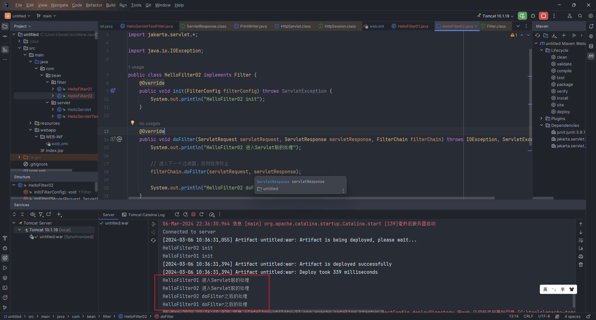

### 一、Servlet App 从入门到入土

1. 使用Maven创建项目(IDEA或者VSCODE)

```shell
.
├── pom.xml
└── src
    └── main
        ├── resources
        └── webapp
            ├── index.jsp
            └── WEB-INF
                └── web.xml
```

2. 编辑pom.xml，在`dependencies`节点添加目前最新的servlet包、Jsp包（2024-03-05）

```xml
<!-- https://mvnrepository.com/artifact/jakarta.servlet/jakarta.servlet-api -->
<dependency>
    <groupId>jakarta.servlet</groupId>
    <artifactId>jakarta.servlet-api</artifactId>
    <version>6.0.0</version>
    <scope>provided</scope>
</dependency>
<!-- https://mvnrepository.com/artifact/jakarta.servlet.jsp/jakarta.servlet.jsp-api -->
<dependency>
    <groupId>jakarta.servlet.jsp</groupId>
    <artifactId>jakarta.servlet.jsp-api</artifactId>
    <version>3.1.1</version>
    <scope>provided</scope>
</dependency>
```

3. 添加Tomcat服务器


4. 在main\java目录下添加包

```shell
.
├── pom.xml
└── src
    └── main
        ├── java
        │   └── com
        │       └── bean
        │           └── servlet
        │               └── HelloServlet.java
        └── webapp
            ├── index.jsp
            └── WEB-INF
                └── web.xml
```

5. 编辑HelloServlet.java文件

```java
package com.bean.servlet;

import jakarta.servlet.ServletException;
import jakarta.servlet.http.HttpServlet;
import jakarta.servlet.http.HttpServletRequest;
import jakarta.servlet.http.HttpServletResponse;

import java.io.IOException;
import java.io.PrintWriter;

public class HelloServlet extends HttpServlet {
    @Override
    protected void doGet(HttpServletRequest req, HttpServletResponse resp) throws ServletException, IOException {
        System.out.println("进入doGET方法");
        PrintWriter out = resp.getWriter();
        out.print("hello servlet");
    }

    @Override
    protected void doPost(HttpServletRequest req, HttpServletResponse resp) throws ServletException, IOException {
        super.doPost(req, resp);
    }
}
```

6. 编辑src/main/webapp/WEB-INF/web.xml

```xml
<web-app>
    <!-- servlet配置 -->
    <servlet>
        <!-- servlet唯一别名 -->
        <servlet-name>hello</servlet-name>
        <!-- servlet包位置 -->
        <servlet-class>com.bean.servlet.HelloServlet</servlet-class>
    </servlet>
    <!-- 网站服务映射 -->
    <servlet-mapping>
        <!-- servlet唯一别名 -->
        <servlet-name>hello</servlet-name>
        <!-- 浏览器匹配规则，匹配上次规则，则查找对应的servlet -->
        <url-pattern>/hello</url-pattern>
    </servlet-mapping>
</web-app>
```

如果希望两个请求连接指向同一个Servlet服务，可以这样编解

```xml
<web-app>
    <!-- servlet配置 -->
    <servlet>
        <!-- servlet唯一别名 -->
        <servlet-name>hello</servlet-name>
        <!-- servlet包位置 -->
        <servlet-class>com.bean.servlet.HelloServlet</servlet-class>
    </servlet>

    <!-- 网站服务映射 -->
    <servlet-mapping>
        <!-- servlet唯一别名 -->
        <servlet-name>hello</servlet-name>
        <!-- 浏览器匹配规则，匹配上次规则，则查找对应的servlet -->
        <url-pattern>/hello1</url-pattern>
    </servlet-mapping>
    <servlet-mapping>
        <servlet-name>hello</servlet-name>
        <url-pattern>/hello2</url-pattern>
    </servlet-mapping>
</web-app>
```

查找方案：
```shell
1. 浏览器请求
2. servlet-mapping(url-pattern)进行匹配
3. 匹配成功后获取到servlet-name
4. servlet(servlet-name)进行查找
5. 找到servlet-class
6. 执行对应class文件，并将结果返回给浏览器界面
```

7. 编译启动，打开浏览器查看

### 二、Servlet getServletContext方法

1. 数据共享

    ```java
    // 获取上下文
    ServletContext context = this.getServletContext();

    context.setAttribute("name", "tom");
    System.out.println((String)context.getAttribute("name"));
    ```

2. 获取Servlt上下文`getServletContext`

    - 编辑src/main/webapp/WEB-INF/web.xml
    ```xml
    <web-app>
        <!-- 添加context-param -->
        <context-param>
            <param-name>jdbc</param-name>
            <param-value>jdbc:mysql://127.0.0.1/webdb</param-value>
        </context-param>

        <servlet>
            <servlet-name>hello</servlet-name>
            <servlet-class>com.bean.servlet.HelloServlet</servlet-class>
        </servlet>
        <servlet-mapping>
            <servlet-name>hello</servlet-name>
            <url-pattern>/hello</url-pattern>
        </servlet-mapping>
    </web-app>
    ```
    - 通过getServletContext方法获取web.xml中的数据
    ```java
    // 获取上下文
    ServletContext context = this.getServletContext();
    System.out.println(context.getInitParameter("jdbc")); // jdbc:mysql://127.0.0.1/webdb
    ```

3. 请求转发（非重定向）

    ```java
    // 获取上下文
    ServletContext context = this.getServletContext();
    context.getRequestDispatcher("/hello2").forward(req, resp);
    ```

4. 读取资源文件

    ```java
    // 在src/main/resources下创建一个配置文件 db.properties
    // 在应用中加载本地资源
    InputStream in = this.getServletContext().getResourceAsStream("/WEB-INF/classes/db.properties")
    Properties properties = new Properties();
    properties.load(in);
    System.out.println(properties.getProperty("username"));
    System.out.println(properties.getProperty("password"));
    ```

### 三、HttpServletResponse

### 四、HttpServletRequest

### 五、Cookie

```java
// 获取cookie
req.getCookies();
// 设置cookie
resp.addCookie();
```

### 六、Session

```java
// 获取session对象
HttpSession session = req.getSession();
// 为session对象设置值
session.setAttribute();
// 获取session对象的值
session.getAttribute();
// 设置session过期
session.invalidate();
```

编辑src/main/webapp/WEB-INF/web.xml
```xml
<!--  设置session配置  -->
<session-config>
    <!--    设置1分钟过期    -->
    <session-timeout>1</session-timeout>
</session-config>
```

### 七、过滤器

1. 编辑过滤器

    ```java
    // HelloFilter01
    package com.bean.filter;

    import jakarta.servlet.*;

    import java.io.IOException;

    public class HelloFilter01 implements Filter {
        @Override
        public void init(FilterConfig filterConfig) throws ServletException {
            System.out.println("HelloFilter01 init");
        }

        @Override
        public void doFilter(ServletRequest servletRequest, ServletResponse servletResponse, FilterChain filterChain) throws IOException, ServletException {
            System.out.println("HelloFilter01 进入Servlet前的处理");

            // 进入下一个过滤器，否则程序终止
            filterChain.doFilter(servletRequest, servletResponse);

            System.out.println("HelloFilter01 doFilter之后的处理");
        }

        @Override
        public void destroy() {
            System.out.println("HelloFilter01 destroy");
        }
    }
    ```
    ```java
    // HelloFilter02
    package com.bean.filter;

    import jakarta.servlet.*;

    import java.io.IOException;

    public class HelloFilter02 implements Filter {
        @Override
        public void init(FilterConfig filterConfig) throws ServletException {
            System.out.println("HelloFilter02 init");
        }

        @Override
        public void doFilter(ServletRequest servletRequest, ServletResponse servletResponse, FilterChain filterChain) throws IOException, ServletException {
            System.out.println("HelloFilter02 进入Servlet前的处理");

            // 进入下一个过滤器，否则程序终止
            filterChain.doFilter(servletRequest, servletResponse);

            System.out.println("HelloFilter02 doFilter之后的处理");
        }

        @Override
        public void destroy() {
            System.out.println("HelloFilter02 destroy");
        }
    }
    ```

2. 编辑web.xml

    ```xml
    <web-app>
        <servlet>
            <servlet-name>hello</servlet-name>
            <servlet-class>com.bean.servlet.HelloServlet</servlet-class>
        </servlet>
        <servlet-mapping>
            <servlet-name>hello</servlet-name>
            <url-pattern>/hello</url-pattern>
        </servlet-mapping>

        <servlet>
            <servlet-name>HelloServletTestFilter</servlet-name>
            <servlet-class>com.bean.servlet.HelloServletTestFilter</servlet-class>
        </servlet>
        <servlet-mapping>
            <servlet-name>HelloServletTestFilter</servlet-name>
            <url-pattern>/filter</url-pattern>
        </servlet-mapping>
        <servlet-mapping>
            <servlet-name>HelloServletTestFilter</servlet-name>
            <url-pattern>/ufilter/filter</url-pattern>
        </servlet-mapping>


        <!-- 过滤器 -->
        <filter>
            <filter-name>filter01</filter-name>
            <filter-class>com.bean.filter.HelloFilter01</filter-class>
        </filter>
        <!-- 过滤器映射 -->
        <filter-mapping>
            <filter-name>filter01</filter-name>
            <!-- 当请求进入/ufilter开头的路径时，开始使用过滤器 -->
            <url-pattern>/ufilter/*</url-pattern>
        </filter-mapping>
        <filter>
            <filter-name>filter02</filter-name>
            <filter-class>com.bean.filter.HelloFilter02</filter-class>
        </filter>
        <filter-mapping>
            <filter-name>filter02</filter-name>
            <!-- 当请求进入/ufilter开头的路径时，开始使用过滤器 -->
            <url-pattern>/ufilter/*</url-pattern>
        </filter-mapping>
    </web-app>
    ```

3. 使用结果

    

4. 使用总结

    过滤器的`doFilter`方法中第三个参数`FilterChain`,通过传入req、resp参数进入下一轮过滤器

    请求进来时，先进入过滤器（可能多个），然后进入Servlet，最后还是通过过滤器返回回来之后响应至前端。过滤器有点类似`洋葱模型`的感觉

