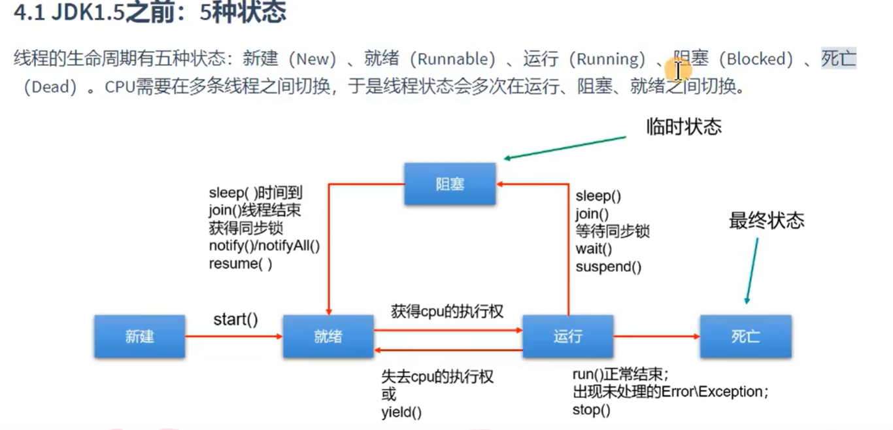
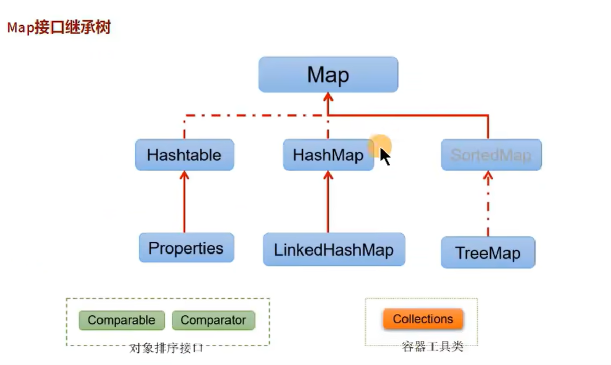

1. 异常处理

    - 处理异常
    - 抛出异常-让调用方去处理异常
        - 格式 在方法名处，添加"throws 异常类型1，异常类型2...."
        - 特定位置抛出异常, 类似python中的raise; 此处抛出的"运行时异常"不需要在方法名处添加异常类型，但"编译异常"需要添加
            - 抛出格式 throw new Excetption("xxxx")

    ```java
    // 处理异常
    public class ErrorTest{

        public String[] names = new String[]{"tom", "jerry"};
        public static void main(String[] args) {
            ErrorTest e1 = new ErrorTest();
            try {
                System.out.println(e1.names[10]);
            } catch(ArrayIndexOutOfBoundsException e){
                System.out.println(e);
            }catch(Exception e){
                System.out.println(e);
            }finally{
                System.out.println("finally");
            }
        }
    }
    ```

    ```java
    // 抛出异常
    class Dog{
        public void div(int x) throws Exception{
            if (x == 0){
                // 向上抛出异常
                throw new Exception("数字不能为0");
            }
            System.out.println(100/x);
        }
    }
    public class ErrorTest {
        public static void main(String[] args) {
            Dog g = new Dog();
            try {
                g.div(0);
            } catch (Exception e) {
                e.printStackTrace();
            }
        }
    }
    ```

2. Java多线程

    - 继承thread类
    - 实现Runable接口 实现run方法
    - 实现Callable接口 实现call方法


    继承thread类
    ```java
    class App extends Thread {
        @Override
        public void run() {
            System.out.println("get url");
        }
    }

    public class threadTest {
        public static void main(String[] args) {
            App app = new App();
            app.start();
        }
    }
    ```
    
    实现Runable接口
    ```java
    class App implements Runnable {

        @Override
        public void run() {
            try {
                Thread.sleep(1000);
                System.out.println("this is :" + Thread.currentThread().getName());
            } catch (Exception e) {
                e.printStackTrace();
            }
        }

    }

    public class threadTest01 {
        public static void main(String[] args) {
            App app = new App();
            new Thread(app).start();
            System.out.println("main thread:" + Thread.currentThread().getName());
        }
    }
    ```

    实现Callable接口
    ```java
    import java.util.concurrent.Callable;
    import java.util.concurrent.FutureTask;

    class AppCall implements Callable {
        @Override
        public Object call() throws Exception {
            int sum = 0;
            for (int i = 0; i <= 100; i++) {
                Thread.sleep(100);
                sum += i;
            }
            return sum;
        }
    }

    public class threadTest06 {
        public static void main(String[] args) {
            AppCall app = new AppCall();
            FutureTask ftask = new FutureTask(app);
            Thread t = new Thread(ftask);
            t.start();
            try {
                t.join();
            } catch (InterruptedException e) {
                e.printStackTrace();
            }

            System.out.println("main over");
            try {
                System.out.println("thread result:" + ftask.get());
            } catch (Exception e) {
                e.printStackTrace();
            }
        }
    }
    ```

3. 线程中常用方法

    - join 直到当前线程执行完毕，主线程处于阻塞
    - yield 让CPU让出当前线程的执行
    - getPriority 获取当前线程的执行优先级
    - setPriority 设置当前线程的执行优先级【1-10之间】

4. 线程的生命周期

    

    


5. 线程的同步（使用`synchronized`进行资源同步）

    - 使用synchronized代码块
    ```java
    // 监视器必须唯一
    // 实现Runable接口，监视器可以使用 this 或者 类名.class
    // 继承thread类，监视器可以使用 类名.class 慎用 this
    synchronized(监视器){
        // 代码块
    }
    ```

    - 使用synchronized方法
    ```java
    // 监视器必须唯一 监视器默认是this
    // 实现Runable接口，自动是唯一的
    // 继承thread类，非静态的方法，监视器还是this，不唯一
    //              静态方法，监视器是当前类，唯一，可以使用
    public synchronized void incr (){
        // 代码块
    }
    ```

    ```java
    public class threadTest04 implements Runnable {

        private int ticket = 10;

        // 出现线程数据异常问题
        // @Override
        // public void run() {
        //     ticket--;
        //     System.out.println(Thread.currentThread().getName() + "当前剩余数量：" + ticket);
        // }

        // 在【属性】和方法上面加 synchronized 同步来限制资源的访问。被 synchronized 包围的代码块称为同步代码块。
        @Override
        public void run() {
            synchronized (this) {
                ticket--;
                System.out.println(Thread.currentThread().getName() + "当前剩余数量：" + ticket);
            }
        }

        // 在属性和【方法】上面加 synchronized 同步来限制资源的访问。
        // @Override
        // public synchronized void run() {
        //     ticket--;
        //     System.out.println(Thread.currentThread().getName() + "当前剩余数量：" + ticket);
        // }

        public static void main(String[] args) {
            threadTest04 th = new threadTest04();
            new Thread(th).start();
            new Thread(th).start();
            new Thread(th).start();
            new Thread(th).start();
            new Thread(th).start();
            new Thread(th).start();
        }
    }
    ```

6. String常用方法

    String->char[] 使用toCharArray()
    
    String->byte[] 使用getBytes()

7. 常见类库

    > StringBuffer 当前类库将创建一个引用类型的字符串，可以对字符串进行修改操作，由于包含`synchronized`,线程安全
    >
    > StringBuilder 当前类库将创建一个引用类型的字符串，可以对字符串进行修改操作，非线程安全
    >
    > Date 获取时间类
    >
    > SimpleDateFormat时间格式化类
    >
    > Calender类
    >
    > LocalDate类
    >
    > LocalTime类
    >
    > LocalDateTime类
    >
    > Math类
    >
    > Random类
    >
    > BigDecimal类 高精度数据计算时使用
    >
    > Timer类
    >
    > TimeTask类
    >


    // Date and SimpleDateFormat simple code
    ```java
    import java.text.ParseException;
    import java.text.SimpleDateFormat;
    import java.util.Date;

    public class datedemo {
        public static void main(String[] args) {
            Date d = new Date();
            System.out.println(d.toString());
            System.out.println(d.getTime());
            java.sql.Date d2 = new java.sql.Date(1683468299278L);
            System.out.println(d2.toString());
            
            SimpleDateFormat s = new SimpleDateFormat("yyyy-MM-dd HH:mm:ss");
            // date -> str
            String ret = s.format(new Date());
            System.out.println(ret);
            // str -> date
            try {
                Date d3 = s.parse(ret);
                System.out.println(d3.toString());
            }
            catch (ParseException e) {
                e.printStackTrace();
            }
        }
    }
    ```

    // Calender simple code
    ```java
    package chapter07.date01;

    import java.util.Calendar;

    public class calenderDemo {
        public static void main(String[] args) {
            Calendar c = Calendar.getInstance();
            System.out.println(c.getTime());
            // 通过get方法 获取当前日期对象在今天的小时
            System.out.println(c.get(Calendar.HOUR_OF_DAY));
        }
    }
    ```

    // LocalDate and LocalTime and LocalDateTime simple code
    ```java
    import java.time.LocalDate;
    import java.time.LocalDateTime;
    import java.time.LocalTime;

    public class jdk8timeDemo {
        public static void main(String[] args) {
            LocalDate nDate = LocalDate.now();
            System.out.println(nDate);
            System.out.println(nDate.getMonth());
            LocalTime nTime = LocalTime.now();
            System.out.println(nTime);
            LocalDateTime nDateTime = LocalDateTime.now();
            System.out.println(nDateTime);
        }
    }
    ```

8. 集合框架

    
    
    

    ```java
    java.util.Collection    // 存一个一个的数据
        List:
            ArrayList、LinkedList、Vector
        Set:
            HashSet、LinkedSet、TreeSet
    java.util.Map       // 存一对一对的数据
        HashMap、LinkedHashMap、TreeMap、Hashtable、Properties
    ```

9. 泛型


    ```markdown
    # 泛型类语法

    [访问权限] class 类名称<范型标识符 1，泛型标识符 2，... ,泛型标识符n>{
    [访问权限] 泛型类型标识符 变量名称;
    [访问权限] 泛型类型标识符 方法名称(){};
    [访问权限] 返回值类型声明 方法名称(泛型类型标识 变量名称){};
    }

    # Java泛型对象声明语法

    类名称<具体类> 对象名称 = new 类名称<具体类>();


    # Java泛型接口

    [访问权限] interface 接口名称<泛型标识>{
    }

    # Java泛型方法

    【在一般类中定义】

    [访问权限]<泛型标识> 泛型标识 方法名称(泛型标识 参数名称){
    //do something
    }
    ```

    ```java
    package generics;


    interface AObj<T> {
        public T getValue();
    }
    // 泛型接口实现方式一 在类上使用泛型
    class A1<T> implements AObj<T> {

        @Override
        public T getValue() {
            System.out.println("嗨，你好啊，我是第一种实现方式");
            return null;
        }
    }

    // 泛型接口实现方式二 指明具体类型
    class A2 implements AObj<String> {
        @Override
        public String getValue() {
            System.out.println("嗨，你好啊，我是第二种实现方式");
            return "嗨，你好啊，我是第二种实现方式";
        }
    }

    public class generics04 {
        public static void main(String[] args) {
            A1<String> a = new A1<>();
            a.getValue();
            A2 b = new A2();
            b.getValue();
        }
    }
    ```

    ```java
    package generics;

    // 在一般类中定义泛型方法
    public class generics05 {
        public <T> T show(T msg){
            System.out.println(msg);
            return msg;
        }
        public static void main(String[] args) {
            generics05 a = new generics05();
            a.show("hello Java generics");
        }
    }
    ```

10. File类&IO流

    

    - 数据流向不同分类
        - 输入流（读取到内存中的流）
            - 以InputStream、Reader结尾
        - 输出流（从内存中写入到其他设备的流）
            - 以OutputStream、Writer结尾
    - 操作数据单位分类
        - 字节流（以字节为单位）
            - 以InputStream、OutputStream结尾
        - 字符流（以字符为单位）
            - 以Reader、Writer结尾
        
    - code 范例

        ```java
        // 字符输入输出流实现文件内容拷贝
        package chapter09;

        import java.io.FileReader;
        import java.io.FileWriter;
        import java.io.IOException;

        public class file004 {
            public static void main(String[] args) throws IOException {
                FileReader r = new FileReader("./chapter09_file01.txt");
                FileWriter w = new FileWriter("./chapter09_file02.txt");

                char[] data = new char[2];
                int len;
                while (true) {
                    len = r.read(data);
                    if (len == -1) {
                        break;
                    }
                    w.write(data);
                }

                r.close();
                w.close();
            }
        }
        ```


        ```java
        // 字节输入输出流实现文件内容的拷贝
        package chapter09;

        import java.io.FileInputStream;
        import java.io.FileOutputStream;
        import java.io.IOException;

        public class file005 {
            public static void main(String[] args) throws IOException {
                FileInputStream r = new FileInputStream("./chapter09_file01.png");
                FileOutputStream w = new FileOutputStream("./chapter09_file02.png");

                byte[] data = new byte[2];
                int len;
                while (true) {
                    len = r.read(data);
                    if (len == -1) {
                        break;
                    }
                    w.write(data);
                }

                r.close();
                w.close();
            }
        }
        ```

        ```java
        //带缓存的字节输入输出流实现文件内容的拷贝
        package chapter09;

        import java.io.BufferedInputStream;
        import java.io.BufferedOutputStream;
        import java.io.FileInputStream;
        import java.io.FileOutputStream;
        import java.io.IOException;

        public class file006 {
            public static void main(String[] args) throws IOException {
                BufferedInputStream r = new BufferedInputStream(new FileInputStream("./chapter09_file01.png"));
                BufferedOutputStream w = new BufferedOutputStream(new FileOutputStream("./chapter09_file03.png"));

                byte[] data = new byte[2];
                int len;
                while (true) {
                    len = r.read(data);
                    if (len == -1) {
                        break;
                    }
                    w.write(data);
                }

                r.close();
                w.close();
            }
        }
        ```

11. 网络编程

    - code 范例

        ```java
        // simple tcp server
        package chapter10;

        import java.io.BufferedReader;
        import java.io.BufferedWriter;
        import java.io.IOException;
        import java.io.InputStreamReader;
        import java.io.OutputStreamWriter;
        import java.net.ServerSocket;
        import java.net.Socket;

        public class socket001 {
            public static void ReadChar(Socket sock) throws IOException {
                BufferedReader inp = new BufferedReader(new InputStreamReader(sock.getInputStream(), "GBK"));

                int size = 20;
                int len = 0;
                int lineSize;
                char[] data = new char[size];
                StringBuilder b = new StringBuilder();
                while (true) {
                    lineSize = 0;
                    while ((len = inp.read(data)) != -1) {
                        for (int i = 0; i < len; i++) {
                            b.append(data[i]);
                            data[i] = ' ';
                        }
                        lineSize += len;
                        if (len < size) {
                            break;
                        }
                    }
                    System.out.println(b.toString());
                    b.delete(0, lineSize);
                }

            }

            public static void PutChar(Socket sock) throws IOException, InterruptedException {
                BufferedWriter outp = new BufferedWriter(new OutputStreamWriter(sock.getOutputStream()));
                while (true) {
                    outp.write("ping " + (int) (Math.random() * 100));
                    outp.flush();
                    Thread.sleep(1000);
                }
            }

            public static void HanderSock(Socket sock) throws IOException {
                try {
                    System.out.println("start conn...");
                    new Thread(() -> {
                        try {
                            ReadChar(sock);
                        } catch (IOException e) {
                            e.printStackTrace();
                        }
                    }).start();
                    new Thread(() -> {
                        try {
                            PutChar(sock);
                        } catch (IOException e) {
                            e.printStackTrace();
                        } catch (InterruptedException e) {
                            e.printStackTrace();
                        }
                    }).start();

                } catch (Exception e) {
                    e.printStackTrace();
                    sock.close();
                }
            }

            public static void main(String[] args) {
                try (ServerSocket s = new ServerSocket(8081)) {
                    while (true) {
                        Socket sock = s.accept();
                        new Thread(() -> {
                            try {
                                HanderSock(sock);
                            } catch (IOException e) {
                                e.printStackTrace();
                            }
                        }).start();
                    }
                } catch (IOException e) {
                    e.printStackTrace();
                }
            }
        }
        ```

        ```java
        // simple tcp client
        package chapter10;

        import java.io.BufferedReader;
        import java.io.IOException;
        import java.io.InputStreamReader;
        import java.net.Socket;
        import java.net.UnknownHostException;

        public class socket002 {
            public static void main(String[] args) throws UnknownHostException, IOException {
                Socket sock = new Socket("127.0.0.1", 8081);
                BufferedReader bf = new BufferedReader(new InputStreamReader(sock.getInputStream()));

                char[] data = new char[20];
                StringBuilder b = new StringBuilder();
                int len;
                while ((len = bf.read(data)) != -1) {
                    b.append(data, 0, len);
                    System.out.println(b.toString());
                    b.delete(0, len);
                }

                bf.close();
                sock.close();
            }
        }
        ```
