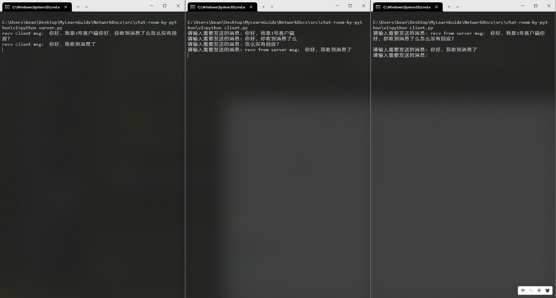

### 一、v1版本实现

介绍: 当前版本有一个服务器端，它将连接过来的Socket放入一个房间中，当接收到房间中任意一个用户的消息时，将会在房间内进行广播，让其他的Socket用户收到消息，从而实现聊天室功能。

不足: 用户发送消息时，由于TCP的粘包问题导致发送的消息无法被其他Socket用户快速接收，且数据堆积在一起无法确认具体的消息内容。

效果图：



源代码：
```python
# NetworkDocs/src/chat-room-by-python/v1/server.py
# server端
import socket
import threading

from common import *

class SocketRoom:

    def __init__(self):
        self.roomList = list()
        self.socket_utils = SocketUtils()

    def join_room(self, sock):
        self.roomList.append(sock)

    def exit_room(self, sock):
        if sock in self.roomList:
            self.roomList.remove(sock)

    def broasd_msg(self, sock, msg):
        for _sock in self.roomList:
            if _sock != sock:
                self.socket_utils.send_sock_msg(_sock, msg)


class Boot:

    def __init__(self):
        self.room = SocketRoom()
        self.socket_utils = SocketUtils()

    def Run(self):
        sock = self.socket_utils.create_server()
        sock.bind(("0.0.0.0", 7256))
        sock.listen(1)
        while True:
            _sock, addr = sock.accept()
            self.room.join_room(_sock)
            threading.Thread(target=self.sock_hander,
                            args=(_sock, addr)).start()

    def sock_hander(self, sock: socket.socket, addr):
        while True:
            msg = self.socket_utils.get_sock_msg(sock)
            if msg == "":
                continue
            if msg == "bye":
                self.room.exit_room(sock)
                sock.close()
                break

            print("recv client msg: ", msg)

            self.room.broasd_msg(sock, msg)


if __name__ == "__main__":
    boot = Boot()
    boot.Run()
```

```python
# NetworkDocs/src/chat-room-by-python/v1/client.py
# client端
import socket
import threading

from common import *

class Boot:

    def __init__(self):
        self.socket_utils = SocketUtils()

    def Run(self):
        sock = self.socket_utils.create_server()
        sock.connect(("127.0.0.1", 7256))
        threading.Thread(target=self.get_sock_hander,
                        args=(sock, ), daemon=True).start()
        t = threading.Thread(target=self.set_sock_hander,
                            args=(sock, ))
        t.start()
        t.join()
        print("client exit")

    def get_sock_hander(self, sock: socket.socket):
        while True:
            msg = self.socket_utils.get_sock_msg(sock)
            if msg == "":
                continue
            print("recv from server msg: ", msg)

    def set_sock_hander(self, sock: socket.socket):
        while True:
            msg = input("请输入需要发送的消息: ")
            if msg == "":
                continue
            self.socket_utils.send_sock_msg(sock, msg)

            if msg == "bye":
                sock.close()
                break


if __name__ == "__main__":
    boot = Boot()
    boot.Run()
```

```python
# NetworkDocs/src/chat-room-by-python/v1/common.py
# 通用Socket工具
import socket

class SocketUtils:

    def create_server(self):
        sock = socket.socket(socket.AF_INET, socket.SOCK_STREAM)
        return sock

    def send_sock_msg(self, sock, msg):
        sock.send(msg.encode("utf8"))

    def get_sock_msg(self, sock):
        datalen = 2
        data = b""
        while True:
            temp = sock.recv(datalen)
            data += temp
            if len(temp) < datalen:
                break
        return data.decode()
```

### 二、v2版本实现

介绍：在上一版本中，由于TCP粘包的问题，导致数据无法正常接收，此版本中对消息体进行简易的封装，实现消息正确的获取。

效果图：


修改方案：

```python
# NetworkDocs/src/chat-room-by-python/v2/server.py
# server端

和NetworkDocs/src/chat-room-by-python/v1/server.py版本一致
```
```python
# NetworkDocs/src/chat-room-by-python/v2/client.py
# client端

和NetworkDocs/src/chat-room-by-python/v1/client.py版本一致
```
```python
# NetworkDocs/src/chat-room-by-python/v2/common.py
# 通用Socket工具
import struct
import socket


HeaderLength = 12
__format = "!3I"

def to_bytes(msg):
    if isinstance(msg, bytes):
        return msg
    if isinstance(msg, str):
        return msg.encode("utf-8")
    return str(msg).encode("utf-8")


def package(msg, version=1, cmd=100):
    __body = to_bytes(msg)
    __header = [version, len(__body), cmd]
    header = struct.pack(__format, *__header)
    body = header + __body
    return body


def unpackage(stroage, msg):
    if len(stroage) < HeaderLength:
        return

    __header = stroage[:HeaderLength]
    version, body_len, _ = struct.unpack(__format, __header)
    if len(stroage) < HeaderLength + body_len:
        return
    body = stroage[HeaderLength:HeaderLength+body_len]

    # 将当前存储数据进行释放，（粘包数据自动释放）
    stroage = stroage[HeaderLength+body_len:]

    return body


class SocketUtils:

    def create_server(self):
        sock = socket.socket(socket.AF_INET, socket.SOCK_STREAM)
        return sock

    def send_sock_msg(self, sock, msg):
        sock.send(package(msg))

    def get_sock_msg(self, sock):
        data = b""
        body = b""
        while True:
            msg = sock.recv(10)
            data += msg
            body = unpackage(data, msg)
            if body:
                break
        return body.decode()
```
