## 1. OpenResty网站

[https://openresty.org/cn/](https://openresty.org/cn/)

[图书: <<OpenResty 最佳实践>>](https://github.com/moonbingbing/openresty-best-practices)

## 2. 生命周期

web服务生命周期


OpenResty关注initing和running两个阶段


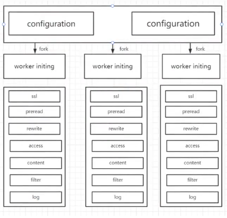

### 2.1 initing阶段

initing阶段在OpenResty中分为三个子阶段

configuration：读取配置文件，解析配置参数，设置运行参数

master-initing: 配置文件解析完毕，master进程初始化公有数据

worker-initing: worker进程自己初始化，进程专用的数据

### 2.2 running阶段

running阶段，收到客户端请求后，会对每一个请求进行以下处理

```shell
1. ssl: ssl/tls 安全通信和验证
2. preread: 在开始处理之前预读数据，接收HTTP请求头
3. rewrite: 检查、改写URI,实现跳转/重定向
4. access: 访问权限控制
5. content: 产生响应内容
6. filter: 对content阶段的内容进行过滤加工
7. log: 请求处理完毕，记录日志
```

## 3. 执行程序

```shell
init_by_lua: master-initing阶段
init_worker_by_lua: worker-initing阶段
ssl_certificate_by_lua: ssl阶段
set_by_lua: rewrite阶段，改写Nginx变量
rewrite_by_lua: rewrite阶段，改写URI,实现跳转/重定向
access_by_lua: access阶段，访问控制&限速
content_by_lua: content阶段，产生响应内容
balancer_by_lua: content阶段，反向代理是选择后端服务器
header_filter_by_lua: filter阶段，加工响应头
body_filter_by_lua: filter极端，加工响应体
log_by_lua: log阶段，用于处理日志
```

## 4. 基础功能

### 4.1 系统信息

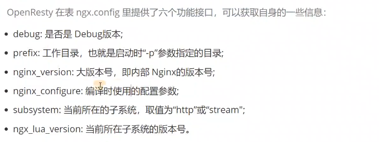

### 4.2 运行日志

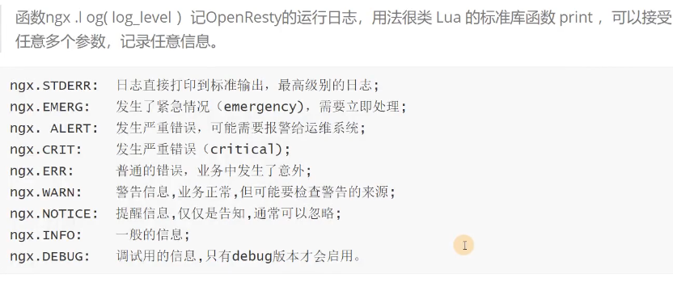

### 4.3 时间日期

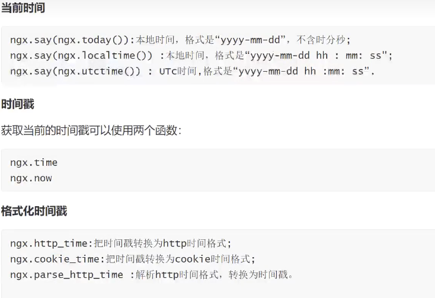

### 4.4 数据编码


### 4.5 正则表达式

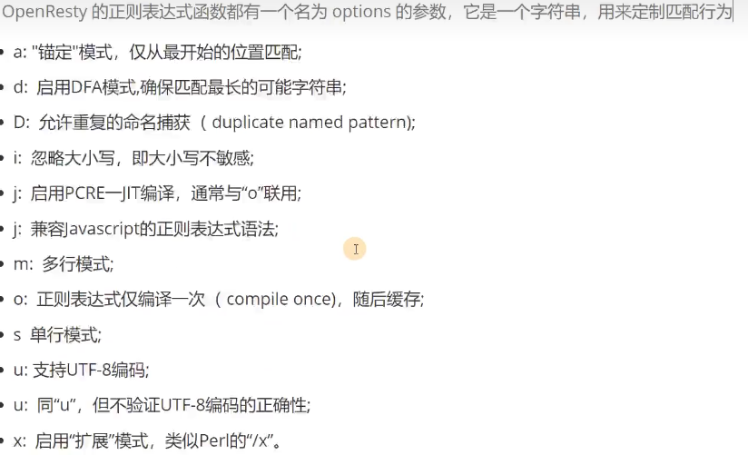

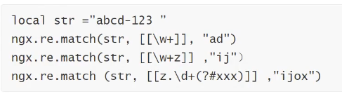


### 4.6 高速缓存

lru cache 访问范围：单worker内

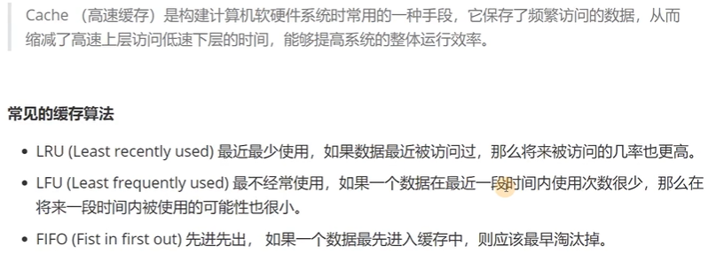


```lua
local lrucache = require("resty.lrucache")
cache, err = lrucache.now(200)
cache:set("name", "tom", 0.01)
ngx.sleep(0.02)
local data, state = cache:get("name")
print(data, state)
```

## 5. HTTP协议相关

### 5.1 HTTP状态码

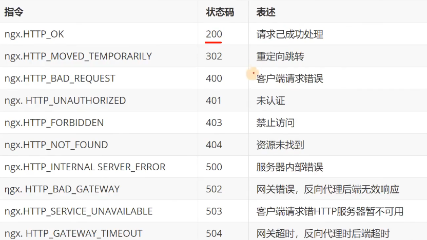

### 5.2 HTTP请求方式


### 5.3 基本信息

- 请求来源

    is_internal = ngx.req.is_internal()

- 起始时间

    ngx.req.start_time()

- 请求头 

    ngx.req.raw_header()

- 暂存数据

    由于OpenResty将请求分成若干阶段，每个阶段都是独立的程序，若需要传递数据，可以使用`ngx.ctx`来进行存储。

### 5.4 HTTP请求行

- 基础信息

    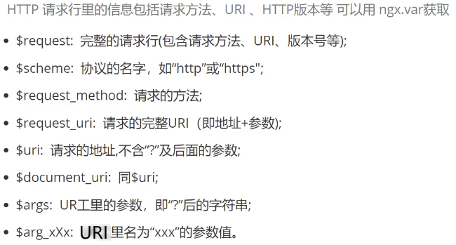

- 版本

    ngx.req.http_version()

- 方法

    ngx.req.get_method() // 获取请求方法

    ngx.req.set_method(ngx.HTTP_POST) // 设置请求方法

- 地址

    ngx.req.uri

- 请求参数

    ngx.req.get_uri_args(数量|多少个参数) // 获取请求参数

- 请求体参数

    ngx.req.read_body() // 必须先读请求体数据

    ngx.req.get_post_args(数量|多少个参数)

### 5.5 HTTP请求头

- ngx.req.get_headers() // 获取请求头

- ngx.req.set_headers() // 更新请求头

- ngx.req.clear_headers() // 清理请求头

### 5.6 HTTP请求体

- ngx.req.discard_body() // 丢弃数据

- ngx.req.get_body_data() // 获取数据，如果是nil,可能是数据过大，放在磁盘中，调用`ngx.req.get_body_file()`获得相应的临时文件名

- ngx.req.set_body_data() // 修改请求体数据

### 5.7 HTTP流程控制

ngx.redirect() // 重定向

ngx.exec() // 跳转到内容其他location

ngx.exit() // 立即结束请求

ngx.eof() // 发送EOF指令，后续不在发送内容

## 6. 后端查询

- 子请求

    res = ngx.location.capture(uri, options) // 发起子请求, 代理uri依赖于Nginx配置的location

    ```shell
    method: 子请求的方法，必须使用节里的数字常量
    
    args:子请求的 URI 参数，可以字符串 可以是表
    
    body:子请求的 body 数据，必须是字符串
    
    ctx:子请求使用的 ngx.ctx 临时数据
    
    vars:子请求可能用到的变量，存储在表里
    
    函数执行后会同步非阻塞地等待请求执行完毕，最后返回一个表，包含四个字段
    
    status 子请求的响应状态码，相当于ngx.status;

    header 子请求的响应头，相当于ngx.header;
    
    body 子请求的响应体:
    
    truncated 错误标志位， body 数据是否被意外截断。
    ```

    用法：

    

- cosocket协程套接字

    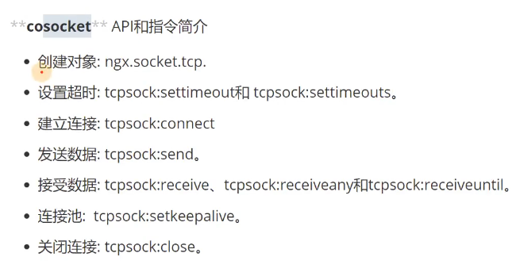

    例子：

    

- http

    使用lua发送http请求
    [https://github.com/ledgetech/lua-resty-http](https://github.com/ledgetech/lua-resty-http)

    simple-demo:

    ```lua
    local httpc = require("resty.http").new()

    -- Single-shot requests use the `request_uri` interface.
    local res, err = httpc:request_uri("http://example.com/helloworld", {
        method = "POST",
        body = "a=1&b=2",
        headers = {
            ["Content-Type"] = "application/x-www-form-urlencoded",
        },
    })
    if not res then
        ngx.log(ngx.ERR, "request failed: ", err)
        return
    end

    -- At this point, the entire request / response is complete and the connection
    -- will be closed or back on the connection pool.

    -- The `res` table contains the expeected `status`, `headers` and `body` fields.
    local status = res.status
    local length = res.headers["Content-Length"]
    local body   = res.body
    ```

- redis

    [https://github.com/openresty/lua-resty-redis](https://github.com/openresty/lua-resty-redis)

    simple-demo

    ```shell
    # you do not need the following line if you are using
    # the OpenResty bundle:
    lua_package_path "/path/to/lua-resty-redis/lib/?.lua;;";

    server {
        location /test {
            # need to specify the resolver to resolve the hostname
            resolver 8.8.8.8;

            content_by_lua_block {
                local redis = require "resty.redis"
                local red = redis:new()

                red:set_timeouts(1000, 1000, 1000) -- 1 sec

                -- or connect to a unix domain socket file listened
                -- by a redis server:
                --     local ok, err = red:connect("unix:/path/to/redis.sock")

                -- connect via ip address directly
                local ok, err = red:connect("127.0.0.1", 6379)

                -- or connect via hostname, need to specify resolver just like above
                local ok, err = red:connect("redis.openresty.com", 6379)

                if not ok then
                    ngx.say("failed to connect: ", err)
                    return
                end

                ok, err = red:set("dog", "an animal")
                if not ok then
                    ngx.say("failed to set dog: ", err)
                    return
                end

                ngx.say("set result: ", ok)

                local res, err = red:get("dog")
                if not res then
                    ngx.say("failed to get dog: ", err)
                    return
                end

                if res == ngx.null then
                    ngx.say("dog not found.")
                    return
                end

                ngx.say("dog: ", res)

                red:init_pipeline()
                red:set("cat", "Marry")
                red:set("horse", "Bob")
                red:get("cat")
                red:get("horse")
                local results, err = red:commit_pipeline()
                if not results then
                    ngx.say("failed to commit the pipelined requests: ", err)
                    return
                end

                for i, res in ipairs(results) do
                    if type(res) == "table" then
                        if res[1] == false then
                            ngx.say("failed to run command ", i, ": ", res[2])
                        else
                            -- process the table value
                        end
                    else
                        -- process the scalar value
                    end
                end

                -- put it into the connection pool of size 100,
                -- with 10 seconds max idle time
                local ok, err = red:set_keepalive(10000, 100)
                if not ok then
                    ngx.say("failed to set keepalive: ", err)
                    return
                end

                -- or just close the connection right away:
                -- local ok, err = red:close()
                -- if not ok then
                --     ngx.say("failed to close: ", err)
                --     return
                -- end
            }
        }
    }
    ```

## 7. 共享内存

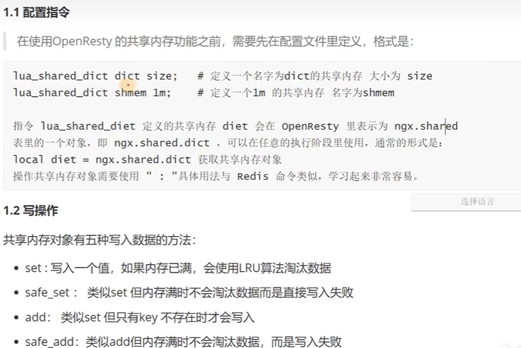

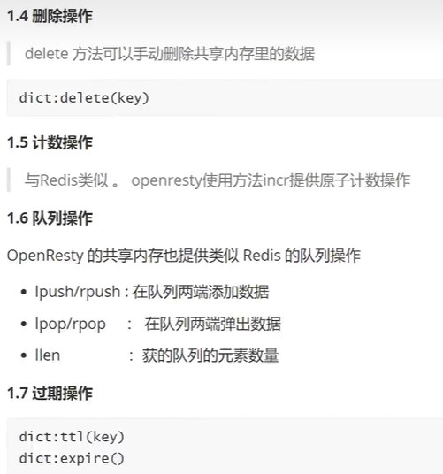

### 7.1 缓存

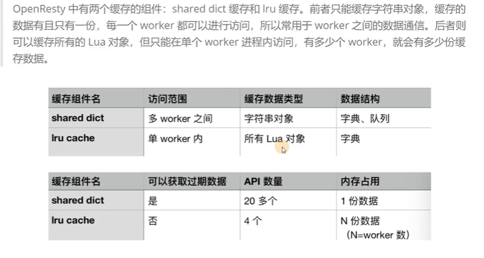