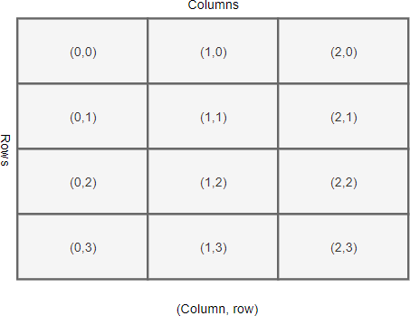
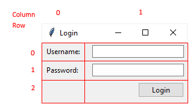
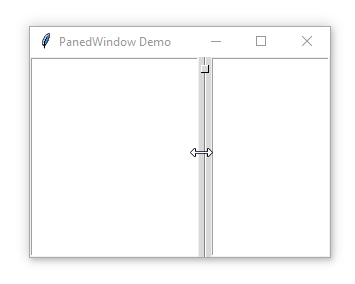
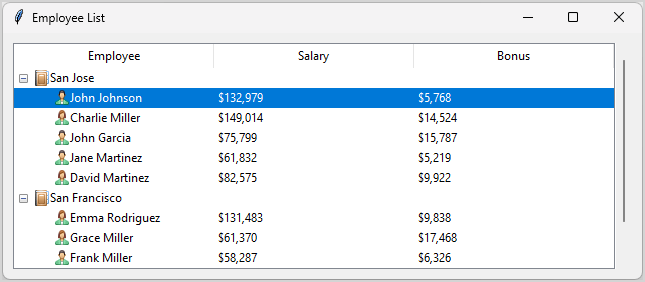
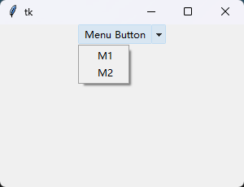

# tkinter 快速入门

## 1. quick start

### 1.1 窗口属性
- 使用 title（） 方法更改窗口标题。
- 使用 geometry（） 方法来更改窗口的大小和位置。
- 使用 resizable（） 方法来指定窗口是可以水平调整大小还是垂直调整大小。
- 使用 window.attributes('-alpha',0.5) 设置窗口的透明度。
- 使用 window.attributes('-topmost', 1) 让窗户始终在顶部。
- 使用 lift（） 和 lower（） 方法将窗口上下移动。
- 使用 iconbitmap（） 方法更改窗口的默认图标。

### 1.2 widget

tk 和 ttk 小部件又有哪些区别？

tk 小部件是传统的 Tkinter 小部件，而 ttk 小部件是基于主题的小部件。

```shell
Button
Checkbutton
Entry
Frame
Label
LabelFrame
Menubutton
PanedWindow
Radiobutton
Scale
Scrollbar
Spinbox

# And the following widgets are new and specific to ttk:
Combobox
Notebook
Progressbar
Separator
Sizegrip
Treeview
```

Tkinter 既有经典款，也有主题小工具（ttk 小工具）。Tk 主题的小部件也被称为 ttk 小部件。

### 1.3 command bind 命令绑定

在 Tkinter 中，为控件的命令选项分配函数名称称为命令绑定。当对应事件发生时，分配的函数将自动调用。

只有少数小部件支持命令选项。

### 1.4 event bind 事件绑定

绑定事件处理函数
`widget.bind(event, handler, add=None)`

解绑事件处理函数
`widget.unbind(event)`

### 1.5 标签显示图片

```python
import tkinter as tk
from tkinter import ttk

root = tk.Tk()
root.geometry("300x200+100+100")


# 标签显示图片
img = tk.PhotoImage(file="./assets/img-1.png")
ttk.Label(
    root,
    text="http & websocket",
    font=("微软雅黑", 18),
    image=img,
    compound="top",
).pack()

root.mainloop()
```

### 1.6 按钮显示图片
```python
import tkinter as tk
from tkinter import messagebox, ttk

root = tk.Tk()
root.geometry("300x200+100+100")


# 按钮
img = tk.PhotoImage(file="./assets/img-1.png")
btn = ttk.Button(
    root,
    text="Click me!",
    image=img,
    compound="top",
)
# 按钮状态
btn.config(state="normal")
btn.config(command=lambda: messagebox.showinfo("Info", "Button clicked!"))
btn.pack()


root.mainloop()
```

### 1.7 输入框

用 `ttk.Entry` 用于创建文本框的入口小工具。
通过 `StringVar` 对象跟踪并更改 Entry 控件的当前值。

```python
import tkinter as tk
from tkinter import ttk

root = tk.Tk()
root.geometry("300x200+100+100")

entry = ttk.Entry(root, width=30, show="*")
# entry.get()  获取输入框内容
entry.bind("<Return>", lambda event: print(entry.get()))
entry.pack()

# 插入默认文本
# entry.insert(0, "请输入内容")

# 聚焦到输入框
# entry.focus()


# 使用stringVar 绑定输入框内容
entry_var = tk.StringVar()
entry2 = ttk.Entry(root, width=30, textvariable=entry_var)
entry2.pack()

# 绑定标签显示输入框内容
ttk.Label(root, textvariable=entry_var).pack()

# 输入框内容改变时, 标签内容也会改变
entry_var.trace(
    "w", lambda name, index, mode: print(name, index, mode, entry_var.get())
)

print(entry_var.get())

root.mainloop()
```

## 2. tkinter pack 布局管理

### 2.1 pack() 布局管理

Tkinter 中最常用的布局管理器。它将小部件按垂直或水平方向打包在一起。

#### 2.1.1 基本用法

```python
import tkinter as tk
from tkinter import ttk

root = tk.Tk()
root.geometry("300x200+100+100")

# 按钮
btn = ttk.Button(root, text="Click me!")
btn.pack()

# 标签
label = ttk.Label(root, text="Hello, Tkinter!")
label.pack()

root.mainloop()
```

#### 2.1.2 选项参数

- side 参数决定了布局中小部件的方向
- expand 参数决定了小部件是否应扩展以占用分配给容器的额外空间
- fill 参数决定了小部件是否应填充分配给容器的额外空间
- ipadx, ipady  小部件内部的水平和垂直填充
- padx, pady  小部件外部的水平和垂直填充
- anchor 参数决定了小部件在其分配空间中的对齐方式

#### 2.1.3 示例

```python
import tkinter as tk

root = tk.Tk()
root.geometry("600x200")

label1 = tk.Label(root, text="username:")
entry1 = tk.Entry(root, width=30)
label2 = tk.Label(root, text="password:")
entry2 = tk.Entry(root, width=30, show="*")
btn = tk.Button(root, text="Login")

label1.pack(anchor=tk.W, ipadx=10, padx=10, pady=5)
entry1.pack(anchor=tk.W, fill=tk.X, ipadx=10, padx=20, pady=5)
label2.pack(anchor=tk.W, ipadx=10, padx=10, pady=5)
entry2.pack(anchor=tk.W, fill=tk.X, ipadx=10, padx=20, pady=5)
btn.pack(anchor=tk.W, ipadx=10, padx=20, pady=5)


root.mainloop()
```

### 2.2 grid() 布局管理

Tkinter 中另一个常用的布局管理器。它将小部件按网格模式组织在一起。



要在一个单元格中放置多个控件，你需要使用像 Frame 或 LabelFrame 这样的容器来包裹控件，并将容器放置在单元格上。


#### 2.2.1 基本用法

```python
import tkinter as tk
from tkinter import ttk

root = tk.Tk()
root.geometry("300x200+100+100")

# 按钮
btn = ttk.Button(root, text="Click me!")
btn.grid(row=0, column=0)

# 标签
label = ttk.Label(root, text="Hello, Tkinter!")
label.grid(row=1, column=0)

root.mainloop()
```

#### 2.2.2 选项参数

- row, column 参数指定了小部件在网格中的位置
- rowspan, columnspan 参数指定了小部件跨越多行或多列
- padx, pady 参数指定了小部件外部的水平和垂直填充
- sticky 参数指定了小部件在其分配空间中的对齐方式

#### 2.2.3 示例



```python
import tkinter as tk
from tkinter import ttk

root = tk.Tk()
root.geometry("300x200+100+100")

# grid 3x2
# 使用 rowconfigure（） 和 columnconfigure（） 方法设置一个由 3 行 2 列组成的网格
# 使用 columnconfigure（） 和 rowconfigure（） 方法来指定网格列和行的权重
root.rowconfigure(0, weight=1)
root.rowconfigure(1, weight=1)
root.rowconfigure(2, weight=1)
root.columnconfigure(0, weight=1)
root.columnconfigure(1, weight=3)

label1 = ttk.Label(root, text="username:")
label1.grid(row=0, column=0, pady=10)
entry1 = ttk.Entry(root, width=30)
entry1.grid(row=0, column=1)

label2 = ttk.Label(root, text="password:")
label2.grid(row=1, column=0, pady=10)
entry2 = ttk.Entry(root, width=30, show="*")
entry2.grid(row=1, column=1)

btn = ttk.Button(root, text="Login")
btn.grid(row=2, column=1, sticky=tk.E, pady=10)


root.mainloop()
```

### 2.3 place() 布局管理

place几何管理器允许你通过消除或相对位置来指定小部件的精确位置。

`widget.place(**options)`

在绝对定位中，你用 x 和 y 参数指定小部件的精确 x 和 y 坐标：

widget.place(x=50, y=50)

在相对位置中，你用 relx 和 rely 参数根据相对坐标放置小部件：

widget.place(relx=0.5, rely=0.5)

位置几何管理器允许你通过宽度和高度参数设置小部件的宽度和高度：

widget.place(width=200, height=100)

可以根据母容器使用相对尺寸。例如，以下代码将小部件的宽度和高度设置为父尺寸的50%：

widget.place(relwidth=0.5, relheight=0.5)

anchor参数用于指定小部件在其指定位置的对齐方式。默认值为'nw'，表示小部件的左上角对齐。

以下代码将控件置于容器控件的中心：

widget.place(relx=0.5, rely=0.5, anchor='center')

## 3. tkinter widgets

### 3.1 Frame 容器


用框架来组织其他小部件 ，无论是视觉上还是编码层面。

`frame = ttk.Frame(master, **options)`

- borderwidth 指定框架的边框宽度。它默认为零
- class_ Set 控件类名称
- cursor 当鼠标光标位于画面上时，改变光标的外观
- height 设定框架高度。
- padding 在框架内和包含的控件外部创建填充。
- relief 指定边框的浮雕样式。为了让它更有效，你还需要设置边框宽度 。
- style 指定自定义控件 自定义样式名称
- takefocus 布尔值指定了焦点遍历过程中是否访问该帧。默认情况下，它是 False。所以画面控件不接受对焦。
- width 设定框架宽度。

#### 3.1.1 frame size

帧的大小取决于其所包含控件的大小和布局。此外，创建框架时可以明确指定框架的高度和宽度：

frame = ttk.Frame(master, height, width)

#### 3.1.2 frame padding

填充允许你在框架内外增加额外空间。填充物以像素表示。

要分别指定画面两侧的填充，可以使用以下方法：

frame['padding'] = (left, top, right, bottom)

#### 3.1.3 frame borders

默认情况下，帧的边界宽度为零。换句话说，框架没有边界。

要为画面设置边框，你需要同时设置边框的宽度和样式。

- flat：没有边框。
- raised：凸起边框。
- sunken：凹陷边框。
- groove：凹槽边框。
- ridge：脊状边框。

要指定边框样式，请使用以下代码：

frame['relief'] = 'raised'

### 3.2 Text 文本控件


Text小部件允许你展示和编辑多行文本区域，并支持多种样式。除了纯文本， Text小部件还支持嵌入图片、链接和自定义格式。

`text = tk.Text(master=None, conf={}, **kw)`

要将内容插入文本控件，可以使用 insert（） 方法。例如：

```python
# “1.0”是第一行的第一个字符。
text.insert("1.0", "Hello, Tkinter!\n")
```

要从文本控件中获取文本内容，可以使用 get（） 方法。例如：

```python
text.get("1.0", "end")
```

要从小部件中删除文本，可以使用 delete（） 方法：

```python
text.delete('1.0', tk.END)
```

#### 3.2.1 embedding link

要在文本控件中嵌入URL链接，你可以使用 tag_add（） 方法为文本添加标签。例如：

```python
text.tag_add("link-1", "1.0", "3.0")
```

要配置标签的样式，例如将其设置为蓝色并下划线，请使用 tag_config（） 方法。例如：

```python
text.tag_config("link-1", foreground="blue", underline=True)
```

要绑定标签的点击事件，例如打开URL链接，请使用 tag_bind（） 方法。例如：

```python
text.tag_bind("link-1", "<Button-1>", lambda e: print("click link-1"))
```

要绑定标签的鼠标离开事件，例如恢复默认光标，请使用 tag_bind（） 方法。例如：

```python
text.tag_bind("link-1", "<Leave>", lambda e: text.config(cursor=""))
```

要绑定标签的鼠标进入事件，例如改变光标为手型，请使用 tag_bind（） 方法。例如：

```python
# 给第一行添加一个标签link-1 添加第一行第一至第十字符的文本链接
text.tag_add("link-1", "1.0", "1.10")
# 配置标签link-1的样式 为蓝色并下划线
text.tag_config("link-1", foreground="blue", underline=True)
# 绑定标签link-1的点击事件
text.tag_bind("link-1", "<Button-1>", lambda e: print("click link-1"))
# 绑定标签link-1的鼠标离开事件 恢复默认光标
text.tag_bind("link-1", "<Leave>", lambda e: text.config(cursor=""))
# 绑定标签link-1的鼠标进入事件 改变光标为手型
text.tag_bind("link-1", "<Enter>", lambda e: text.config(cursor="hand2"))
```

#### 3.2.2 embedding image

要将图片嵌入文本内容，使用 image_create 方法。例如：

```python
# 加载图片
image = tk.PhotoImage(file="image.png")
# 在文本控件中插入图片
text.image_create("1.0", image=image)
```

### 3.3 scrollbar 滚动条


滚动条允许你查看另一个小部件的所有部分，而这些小部件的内容通常大于可用空间

创建滚动条小部件,滚动条构建器：

`ttk.Scrollbar(master=None, **kw)`

```python
scrollbar = ttk.Scrollbar(
    scrollable_widget, # Widget
    orient=tk.VERTICAL, # Vertical scrollbar
    command=scrollable_widget.yview # Link scrollbar to scrollable_widget widget
)
```

为了将滚动条与文本小部件关联起来，你需要将文本小部件的 yscrollcommand 属性设置为滚动条的 set 方法。例如：

```python
import tkinter as tk
from tkinter import ttk


root = tk.Tk()
root.geometry("300x200")

scrollbar = ttk.Scrollbar(root, orient="vertical")
scrollbar.pack(side="right", fill="y")

text = tk.Text(root, height=8, insertbackground="red")
text.pack(padx=10, pady=10, expand=True, fill=tk.BOTH)
text.insert(tk.END, "1-1\n" * 30)

# 配置text的垂直滚动条
# 通过将 scrollbar.set 方法分配给文本控件的 yscrollcommand，并将文本控件的 text.yview 映射到滚动条控件的命令中，将卷轴小部件关联起来
text.config(yscrollcommand=scrollbar.set)
# 配置滚动条的命令
scrollbar.config(command=text.yview)

root.mainloop()
```

### 3.4 ScrolledText 滚动文本框

scrollbar + text 的组合，用于展示和编辑多行文本区域，并支持滚动查看超出可见区域的内容。

```python
import tkinter as tk
from tkinter.scrolledtext import ScrolledText


from tkinter.constants import END

stext = ScrolledText(bg='white', height=10)
stext.insert(tk.END, "__doc__\n"*20)
stext.pack(fill=tk.BOTH, side=tk.LEFT, expand=True)
stext.focus_set()
stext.mainloop()
```

### 3.5 Listbox 列表框

Listbox 允许你浏览这些物品，同时选择一个或多个项目.

使用 Listbox 构造器创建一个列表框小部件：

`tk.Listbox(master=None, cnf={}, **kw)`


#### 3.5.1 列表框小部件添加项目：

首先，创建一个变量对象，并将其值初始化为项列表：

```python
items = ["Item 1", "Item 2", "Item 3", "Item 4"]
list_items = tk.Variable(value=items)
```

其次，将该变量对象分配给列表框控件的列表变量选项：

```python
listbox = tk.Listbox(root, listvariable=list_items)
listbox.pack()
```

完整例子：
```python
import tkinter as tk
from tkinter import ttk

root = tk.Tk()
root.geometry("300x200+100+100")

items = ["Item 1", "Item 2", "Item 3", "Item 4"]
list_items = tk.Variable(value=items)

listbox = tk.Listbox(root, listvariable=list_items)
listbox.pack()

root.mainloop()
```

#### 3.5.2 设置选择模式 selectmode：

- tk.BROWSE  允许单一选择。如果你选中一个项目并拖到另一行，选择会跟随鼠标移动。这是默认的。
- tk.EXTENDED  通过点击第一个项目并拖到最后一行，一次性选择相邻的一组物品。
- tk.SINGLE  允许你选择一行，且不能拖动鼠标。
- tk.MULTIPLE  一次选择任意数量的行。点击任意一行可以切换是否被选中。

#### 3.5.3 绑定事件

如果你想在用户选择列表项目时自动执行某个函数，可以将该函数绑定到 <<ListboxSelect>> 事件：

`listbox.bind('<<ListboxSelect>>', callback)`

通过列表框实例的 `curselection（）` 方法获取当前选中的列表项目。

完整例子：
```python
import tkinter as tk
from tkinter.messagebox import showinfo


def handle_item_select(event):
    selected_indices = listbox.curselection()
    selected_languages = ",".join([listbox.get(i) for i in selected_indices])

    showinfo(title="Information", message=f"You selected: {selected_languages}")


root = tk.Tk()
root.geometry("300x200+100+100")

items = ["Item 1", "Item 2", "Item 3", "Item 4"]
list_items = tk.Variable(value=items)

listbox = tk.Listbox(
    root,
    listvariable=list_items,
    selectmode=tk.SINGLE,
)

listbox.bind("<<ListboxSelect>>", handle_item_select)
listbox.pack()


root.mainloop()
```

#### 3.5.4 在Listbox中添加滚动条

```python
import tkinter as tk
from tkinter import ttk

root = tk.Tk()
root.geometry("300x200+100+100")

scroller = ttk.Scrollbar(root, orient=tk.VERTICAL)
scroller.pack(side=tk.RIGHT, fill=tk.Y)

items = [f"Item {i}" for i in range(100)]
list_items = tk.Variable(value=items)

listbox = tk.Listbox(
    root,
    listvariable=list_items,
    selectmode=tk.SINGLE,
)
listbox.config(yscrollcommand=scroller.set)
scroller.config(command=listbox.yview)
listbox.pack(fill=tk.BOTH)

root.mainloop()
```

### 3.6 Separator 分隔符

分隔器小部件在两组小部件之间放置一条细的水平或垂直线。

`sep = ttk.Separator(master=None, orient=tk.HORIZONTAL)`

完整例子：
```python
import tkinter as tk
from tkinter import ttk

root = tk.Tk()
root.geometry("300x200+100+100")

ttk.Label(root, text="label-1").pack(side=tk.LEFT, expand=True)

# 水平分割线
# separator = ttk.Separator(root, orient=tk.HORIZONTAL)
separator = ttk.Separator(root, orient=tk.VERTICAL)
separator.pack(side=tk.LEFT, fill=tk.Y, pady=10)

ttk.Label(root, text="label-2").pack(side=tk.RIGHT, expand=True)


root.mainloop()
```

### 3.7 checkbox 复选框

复选框小部件允许用户选择一个或多个选项。

`checkbox = ttk.Checkbutton(master=None, cnf={}, **kw)`

完整例子：
```python
import tkinter as tk
from tkinter import ttk

root = tk.Tk()
root.geometry("300x200+100+100")

agreement_var = tk.StringVar()

checkbox = ttk.Checkbutton(
    root,
    text="Check me",
    offvalue="OFF",
    onvalue="ON",
    variable=agreement_var,
    command=lambda: print(agreement_var.get()),
)

checkbox.pack()

root.mainloop()
```

### 3.8 Radiobutton 单选按钮

单选按钮允许你在多个互斥选项中选择。

`ttk.Radiobutton(container, text='Option 1', value='Value 1', variable=selected)`

完整例子
```python
import tkinter as tk
from tkinter import ttk

root = tk.Tk()
root.geometry("300x200+100+100")

selector_var = tk.StringVar()

r1 = ttk.Radiobutton(
    root,
    text="Check me - 1",
    value="1",
    variable=selector_var,
    command=lambda: print(selector_var.get()),
)
r2 = ttk.Radiobutton(
    root,
    text="Check me - 2",
    value="2",
    variable=selector_var,
    command=lambda: print(selector_var.get()),
)
r1.pack()
r2.pack()


root.mainloop()
```

### 3.9 Comboxbox 下拉选择框

下拉选择框（Combobox）允许用户从预定义选项中选择一个值。

`ttk.Combobox(container, textvariable=selected, values=options)`

完整例子
```python
import tkinter as tk
from tkinter import ttk

root = tk.Tk()
root.geometry("300x200+100+100")

selector_var = tk.StringVar()

combo = ttk.Combobox(
    root,
    textvariable=selector_var,
    values=["Option 1", "Option 2", "Option 3"],
)
# 只读状态，用户只能选择已有的选项，不能输入自定义值
combo["state"] = "readonly"
combo.bind("<<ComboboxSelected>>", lambda event: print(selector_var.get()))
combo.pack()


root.mainloop()
```

### 3.10 panedwindow 分隔窗口

PaneWindow 小部件用于分割框架或窗口的空间。 A PaneWindow is like a Frame，作为容器来存放子控件

通常，PanedWindow 包含一个垂直或水平的子控件堆栈：




完整例子：
```python
import tkinter as tk
from tkinter import ttk

root = tk.Tk()
root.geometry("300x200+100+100")

# style = ttk.Style()
# style.theme_use("classic")


pw = ttk.PanedWindow(root, orient=tk.HORIZONTAL)

listbox1 = tk.Listbox(root)
pw.add(listbox1)
listbox2 = tk.Listbox(root)
pw.add(listbox2)

pw.pack()

root.mainloop()
```

### 3.11 slider 滑动条

滑动条（Slider）允许用户通过拖动滑块来选择一个数值范围。

`ttk.Scale(container, from_=min, to=max, orient=tk.HORIZONTAL)`

完整例子
```python
import tkinter as tk
from tkinter import ttk

root = tk.Tk()
root.geometry("300x200+100+100")

slider_var = tk.DoubleVar()


slider = ttk.Scale(
    root,
    from_=0,
    to=100,
    variable=slider_var,
    orient=tk.HORIZONTAL,
    # orient=tk.VERTICAL,
    command=lambda event: print(slider_var.get()),
)
# 禁用滑动条
# slider["state"] = "disabled"
slider.pack()


root.mainloop()
```

### 3.12 spinbox 微调框

微调框（Spinbox）允许用户通过点击按钮来增加或减少数值。

`ttk.Spinbox(master, from_, to, textvariable, wrap)`

如果 wrap 设置为 True，当当前值达到最大值时，点击向上箭头时，当前值会被设置为最低值，反之亦然。

完整例子
```python
import tkinter as tk
from tkinter import ttk

root = tk.Tk()
root.geometry("300x200+100+100")

spinbox_var = tk.StringVar(value=0)

spinbox = ttk.Spinbox(
    root,
    from_=0,
    to=100,
    textvariable=spinbox_var,
    # wrap=True,
    command=lambda: print(spinbox_var.get()),
)
# 禁用微调框
# spinbox["state"] = "disabled"
spinbox.pack()


root.mainloop()
```

### 3.13 Sizegrip 大小调整 grip

大小调整 grip 是一个小的可拖动区域，用于调整父容器的大小。

`ttk.Sizegrip(container)`

完整例子
```python
import tkinter as tk
from tkinter import ttk

root = tk.Tk()
root.geometry("300x200+100+100")

sizegrip = ttk.Sizegrip(root)
sizegrip.pack(side=tk.BOTTOM, anchor=tk.SE)

root.mainloop()
```

### 3.14 LabelFrame 标签框架

标签框架（LabelFrame）是一个带标签的框架，用于组织其他小部件。例如，你可以将 Radiobutton 小部件分组，并将其放置在 LabelFrame 上。

`ttk.LabelFrame(container, text='Frame Title')`

完整例子
```python
import tkinter as tk
from tkinter import ttk

root = tk.Tk()
root.geometry("300x200+100+100")

labelframe = ttk.LabelFrame(
    root,
    text="Frame Title",
    height=150,
    width=150,
    padding=10,
)
labelframe.pack(padx=10, pady=10)

checkbox = ttk.Checkbutton(labelframe, text="Check me")
checkbox.pack()

root.mainloop()
```

### 3.15 Progressbar 进度条

进度条（Progressbar）用于显示任务的完成进度。

`ttk.Progressbar(container, orient, length, mode)`

#### 3.15.1 进度条模式mode

进度条有两种模式：

- determinate：进度条显示任务的完成进度。
- indeterminate：进度条显示任务正在进行中，没有具体的完成进度。

#### 3.15.2 进度条方法

进度条有以下方法：

- start()：开始进度条动画。
- stop()：停止进度条动画。
- step()：增加进度条的进度。
- configure()：配置进度条的属性。


完整例子
```python
import tkinter as tk
from tkinter import ttk

root = tk.Tk()
root.geometry("300x200+100+100")

progressbar = ttk.Progressbar(
    root,
    orient=tk.HORIZONTAL,
    length=100,
    mode="determinate",
)
progressbar.pack()


def start_progress():
    progressbar.start()
    val = progressbar["value"]
    progress_label.config(text=f"Progress: {val}%")


progress_label = ttk.Label(root, text="Progress: 0%")
progress_label.pack()

btn = ttk.Button(root, text="Start", command=start_progress)
btn.pack()


root.mainloop()
```

### 3.16 NoteBook 选项卡

选项卡（Notebook）是一个容器，用于组织多个子控件。每个子控件都有一个选项卡，用户可以通过点击选项卡来切换显示的子控件。

`ttk.Notebook(container)`

完整例子
```python
import tkinter as tk
from tkinter import ttk

root = tk.Tk()
root.geometry("300x200+100+100")

notebook = ttk.Notebook(root)
notebook.pack()

frame1 = ttk.Frame(notebook, width=300, height=200)
notebook.add(frame1, text="Tab 1")

frame2 = ttk.Frame(notebook, width=300, height=200)
notebook.add(frame2, text="Tab 2")

frame3 = ttk.Frame(notebook, width=300, height=200)
notebook.add(frame3, text="Tab 3")

# 选择第二个选项卡
notebook.select(frame2)

# 获取当前选择的选项卡
current_tab = notebook.select()
print(current_tab)

# 隐藏第一个选项卡
notebook.hide(frame1)

# 移除第一个选项卡
notebook.forget(frame1)

root.mainloop()
```

### 3.17 Treeview 树视图

树视图小部件允许你显示分层的项目集合。每个项目都有标签、可选图标和可选的数据值列表。 树视图控件在树标签后连续列显示数据值。



`treeview = ttk.Treeview(master=None, **kw)`

完整例子
```python
import tkinter as tk
from tkinter import ttk

root = tk.Tk()
root.geometry("400x200")
root.title("Tkinter Treeview")

# 创建树视图
treeview = ttk.Treeview(columns=("Name", "Number"))
# 设置列标题
treeview.heading("#0", text="City")
treeview.heading("Name", text="Name")
treeview.heading("Number", text="Number")

scrollbar = ttk.Scrollbar(root, orient="vertical", command=treeview.yview)
scrollbar.pack(side=tk.RIGHT, fill=tk.Y)
treeview.configure(yscroll=scrollbar.set)

# 插入一级项目
level1 = treeview.insert("", tk.END, text="湖北", open=True)
# 插入二级项目
treeview.insert(level1, tk.END, text="武汉", values=("100000",))
treeview.insert(level1, tk.END, text="荆州", values=("100001",))
treeview.insert(level1, tk.END, text="宜昌", values=("100002",))
treeview.insert(level1, tk.END, text="黄石", values=("100003",))
treeview.insert(level1, tk.END, text="黄石", values=("100003",))
treeview.insert(level1, tk.END, text="黄石", values=("100003",))
treeview.insert(level1, tk.END, text="黄石", values=("100003",))
treeview.insert(level1, tk.END, text="黄石", values=("100003",))

treeview.pack(fill=tk.BOTH, expand=True, padx=10, pady=10)
root.mainloop()
```

### 3.18 Canvas 画布

Canvas小部件是 Tkinter 中最灵活的小部件。Canvas 小部件允许你构建从自定义小部件到完整用户界面的任何东西。

`tk.Canvas(root, width=600, height=400, bg='white')`

#### 3.18.1 画布方法
- Line  线路	create_line()
- Rectangle  矩形	create_rectangle()
- Oval  椭圆赛道	create_oval()
- Arc  故事弧	create_arc()
- Polygon  多边形	create_polygon()
- Text  发短信	create_text()
- Image  图像	create_image()

#### 3.18.2 事件处理

同Text事件处理tag_bind()

```python
canvas.tag_bind(
    image_item,
    '<Button-1>',
    lambda e: canvas.delete(image_item)
)
```

完整例子
```python
import tkinter as tk

root = tk.Tk()

root.geometry("400x300")
canvas = tk.Canvas(root, width=600, height=400, bg="white")

a = canvas.create_line(100, 100, 200, 200, fill="red")
b = canvas.create_rectangle(100, 100, 150, 150, fill="blue")

# 绑定事件&canvas.delete用来删除对应标记原始
canvas.tag_bind(b, "<Button-1>", lambda e: canvas.delete(a))

canvas.pack()

root.mainloop()
```

### 3.19 cursor 光标

在 Tkinter 应用中设置控件的光标状态。

完整例子
```python
import tkinter as tk
from tkinter import ttk

root = tk.Tk()
root.geometry("400x300")
# 设置光标为watch,忙碌状态
root.config(cursor="")


def handler_click():
    root.config(cursor="watch")
    btn.config(cursor="watch")


btn = ttk.Button(
    root,
    text="Click me",
    cursor="arrow",
    command=handler_click,
)
btn.pack()

root.mainloop()
```

## 4. tkinter Dialog and Menus

### 4.1 messagebox 消息框

showinfo()
showwarning()
showerror()

完整例子
```python
import tkinter as tk
from tkinter import messagebox, ttk

root = tk.Tk()
root.geometry("300x200+100+100")

ttk.Button(
    root,
    text="INFO",
    command=lambda: messagebox.showinfo(
        "Info",
        "Hello from py-tk!",
    ),
).pack()
ttk.Button(
    root,
    text="WARNING",
    command=lambda: messagebox.showwarning(
        "WARNING",
        "Hello from py-tk!",
    ),
).pack()
ttk.Button(
    root,
    text="ERROR",
    command=lambda: messagebox.showerror(
        "ERROR",
        "Hello from py-tk!",
    ),
).pack()

root.mainloop()
```

### 4.2 askyesno() 确认消息框

```python
import tkinter as tk
from tkinter import messagebox, ttk

root = tk.Tk()
root.geometry("300x200+100+100")


def handle_click():
    answer = messagebox.askyesno(
        "Info",
        "Hello from py-tk!",
    )
    if answer:
        print("Yes")
    else:
        print("No")


ttk.Button(
    root,
    text="Click me",
    command=handle_click,
).pack()

root.mainloop()
```

### 4.3 askokcancel() 确认取消消息框

```python
import tkinter as tk
from tkinter import messagebox, ttk

root = tk.Tk()
root.geometry("300x200+100+100")


def handle_click():
    answer = messagebox.askokcancel(
        "Info",
        "Hello from py-tk!",
    )
    if answer:
        print("OK")
    else:
        print("Cancel")


ttk.Button(
    root,
    text="Click me",
    command=handle_click,
).pack()

root.mainloop()
```

### 4.4 askretrycancel() 重试取消消息框

```python
import tkinter as tk
from tkinter import messagebox, ttk

root = tk.Tk()
root.geometry("300x200+100+100")


def handle_click():
    answer = messagebox.askretrycancel(
        "Info",
        "Hello from py-tk!",
    )
    if answer:
        print("Retry")
    else:
        print("Cancel")


ttk.Button(
    root,
    text="Click me",
    command=handle_click,
).pack()

root.mainloop()
```

### 4.5 open file dialog 打开文件对话框

`from tkinter import filedialog`

- `filedialog.askopenfilename()` 打开文件对话框并选择一个文件后返回文件路径
- `filedialog.askopenfilenames()` 打开多个文件对话框并选择多个文件后返回多个文件路径
- `filedialog.askopenfile()` 直接打开文件
- ...

完整例子
```python
import tkinter as tk
from tkinter import filedialog, messagebox, ttk

root = tk.Tk()
root.geometry("300x200+100+100")


def handle_click():
    filename = filedialog.askopenfilename(
        title="Open file",
        filetypes=[
            ("Text files", "*.txt"),
            ("All files", "*.*"),
        ],
    )
    if filename:
        print(filename)


ttk.Button(
    root,
    text="Click me",
    command=handle_click,
).pack()

root.mainloop()
```

### 4.6 color choose dialog 颜色选择对话框

`from tkinter import colorchooser`

- `colorchooser.askcolor()` 打开颜色选择对话框并返回选择的颜色
- ...

完整例子
```python
import tkinter as tk
from tkinter import colorchooser, messagebox, ttk

root = tk.Tk()
root.geometry("300x200+100+100")


def handle_click():
    color = colorchooser.askcolor(
        title="Choose color",
    )
    if color:
        print(color)


ttk.Button(
    root,
    text="Click me",
    command=handle_click,
).pack()

root.mainloop()
```

### 4.7 Menu 菜单

Tkinter 原生支持菜单。它会显示程序所运行目标平台的外观和界面，例如 Windows、macOS 和 Linux。

```python
from tkinter import Menu
# 初始化菜单
menu_bar = Menu(root)
# 添加菜单到root
root.config(menu=menu_bar)
# 添加菜单选项
menu_bar.add_command(
    label="M1",
    command=lambda: print("M1"),
)
```

完整例子
```python
import tkinter as tk
from tkinter import Menu

root = tk.Tk()
root.geometry("300x200+100+100")

# 初始化菜单
menu_bar = Menu(root)
# 添加菜单到root
root.config(menu=menu_bar)

# 添加菜单选项
menu_bar.add_command(
    label="M1",
    command=lambda: print("M1"),
)
menu_bar.add_command(
    label="M2",
    command=lambda: print("M2"),
)

# 添加子菜单
# 初始化子菜单
sub_menu = Menu(menu_bar, tearoff=0)
# 添加子菜单到主菜单
menu_bar.add_cascade(label="M3", menu=sub_menu)
# 添加子菜单选项
sub_menu.add_command(label="S1", command=lambda: print("S1"))
# 添加分隔线
sub_menu.add_separator()
sub_menu.add_command(label="S2", command=lambda: print("S2"))

# 添加子菜单选项
sub_menu_options = Menu(sub_menu, tearoff=0)
# 添加子菜单选项到子菜单
sub_menu.add_cascade(label="Options", menu=sub_menu_options)
# 添加子菜单选项到子菜单选项
sub_menu_options.add_command(label="O1", command=lambda: print("O1"))
sub_menu_options.add_command(label="O2", command=lambda: print("O2"))


root.mainloop()
```

### 4.8 Menubutton 菜单按钮

用来创建一个菜单按钮，点击它会弹出一个菜单。

`ttk.Menubutton(master, **kw)`



完整例子
```python
import tkinter as tk
from tkinter import Menu, ttk

root = tk.Tk()
root.geometry("300x200+100+100")

mb = ttk.Menubutton(root, text="Menu Button")
mb.pack()

# 初始化菜单
menu_bar = Menu(mb, tearoff=0)
# 添加菜单到root
mb.config(menu=menu_bar)

# 添加菜单选项
menu_bar.add_command(
    label="M1",
    command=lambda: print("M1"),
)
menu_bar.add_command(
    label="M2",
    command=lambda: print("M2"),
)

root.mainloop()
```

### 4.9 OptionMenu 选项菜单

用来创建一个选项菜单，用户可以从多个选项中选择一个。

`ttk.OptionMenu(master, variable, default, *values, **kw)`

完整例子
```python
import tkinter as tk
from tkinter import ttk

root = tk.Tk()
root.geometry("300x200+100+100")

obstr = tk.StringVar()
obstr.set("M1")

ob = ttk.OptionMenu(
    root,
    obstr,
    "M1",
    "M1",
    "M2",
    command=lambda *args: print(args, obstr.get()),
)
ob.pack()

root.mainloop()
```

## 5. Tkinter OOP

### 5.1 简单的 OOP 例子

```python
import tkinter as tk
from tkinter import ttk


class App(tk.Tk):
    def __init__(self):
        super().__init__()
        self.geometry("300x200+100+100")
        self.title("Simple App")
        # 按钮
        btn = ttk.Button(self, text="Click me!")
        btn.pack()


if __name__ == "__main__":
    app = App()
    app.mainloop()
```

### 5.2 继承 Tk.Frame 类

一个 Tkinter 应用程序应该只有一个 Tk 实例。

```python
import tkinter as tk
from tkinter import ttk
from tkinter.messagebox import showinfo


class MainFrame(ttk.Frame):
    def __init__(self, container):
        super().__init__(container)

        options = {"padx": 5, "pady": 5}

        # label
        self.label = ttk.Label(self, text="Hello, Tkinter!")
        self.label.pack(**options)

        # button
        self.button = ttk.Button(self, text="Click Me")
        self.button["command"] = self.button_clicked
        self.button.pack(**options)

        # show the frame on the container
        self.pack(**options)

    def button_clicked(self):
        showinfo(title="Information", message="Hello, Tkinter!")


class App(tk.Tk):
    def __init__(self):
        super().__init__()
        self.geometry("300x200+100+100")
        self.title("Simple App")


if __name__ == "__main__":
    app = App()
    frame = MainFrame(app)
    app.mainloop()
```

### 5.3 switching between frames 切换帧

通常，Tkinter 应用由多个`frames`组成。而且你经常需要在帧之间切换，以显示与用户选择相关的画面。

Tkinter 允许你把`frames`叠在一起。要显示特定`frames`，你可以按叠加顺序将`frames`往上加。顶部的框架会显现出来。

要将框架带到顶部，使用框架控件中的 tkraise（） 方法，如下所示：

```python
frame.tkraise()
```

完整例子
```python
import tkinter as tk
from tkinter import ttk


class App(tk.Tk):
    def __init__(self):
        super().__init__()
        self.title("帧切换示例")
        self.geometry("400x300")

        # 1. 创建父容器（所有Frame的共同父级）
        self.container = ttk.Frame(self)
        self.container.pack(fill="both", expand=True)  # 占满主窗口

        # 2. 定义所有需要切换的Frame
        self.frames = {}  # 存储Frame实例，方便调用
        for F in (HomePage, SettingsPage):
            frame = F(self.container, self)  # 父容器是self.container
            self.frames[F] = frame
            # 关键：所有Frame用grid布局重叠（row=0, column=0，占满父容器）
            frame.grid(row=0, column=0, sticky="nsew")

        # 3. 初始显示首页
        self.show_frame(HomePage)

    def show_frame(self, frame_class):
        """切换到指定Frame的方法"""
        frame = self.frames[frame_class]
        frame.tkraise()  # 核心：将目标Frame提升到最上层


# 定义首页Frame
class HomePage(ttk.Frame):
    def __init__(self, parent, controller):
        super().__init__(parent)
        # controller是主App实例，用于调用show_frame切换页面
        self.controller = controller

        # 首页控件
        ttk.Label(self, text="首页").pack(pady=50)
        # 切换到设置页的按钮
        ttk.Button(
            self,
            text="进入设置页",
            command=lambda: self.controller.show_frame(SettingsPage),
        ).pack(pady=20)


# 定义设置页Frame
class SettingsPage(ttk.Frame):
    def __init__(self, parent, controller):
        super().__init__(parent)
        self.controller = controller

        # 设置页控件
        ttk.Label(self, text="设置页").pack(pady=50)
        # 切换回首页的按钮
        ttk.Button(
            self, text="返回首页", command=lambda: self.controller.show_frame(HomePage)
        ).pack(pady=20)


if __name__ == "__main__":
    app = App()
    app.mainloop()
```

## 6. Tkinter Themes 主题

在 Tkinter 中，主题决定了所有小部件的“外观和感觉”。它是所有 TTK 控件的样式集合。

完整例子
```python
import tkinter as tk
from tkinter import ttk

root = tk.Tk()

root.geometry("300x200+100+100")

# 样式
style = ttk.Style(root)

# 设置主题
style.theme_use("xpnative")

# 获取所有的主题
print(style.theme_names())

ttk.Button(root, text="Click me!").grid(row=0, column=0)

root.mainloop()
```

### 6.1 主题风格介绍

样式是对小部件类外观的描述。通常，一个主题会伴随一套预设的风格。

ttk 小部件的样式名称以字母 'T' 开头，后跟小部件名称，例如 TLabel 和 TButton

完整例子
```python
import tkinter as tk
from tkinter import ttk

root = tk.Tk()

root.geometry("300x200+100+100")

btn = ttk.Button(root, text="Click me!")
btn.grid(row=0, column=0)

# 获取按钮的样式类 TButton
print(btn.winfo_class())

style = ttk.Style(root)
# 更新TButton的样式
style.configure("TButton", font=("fire code", 12))


root.mainloop()
```

## 7. value holders 值保持器

- StringVar: 用于存储和管理字符串值。
- IntVar: 用于存储和管理整数值。
- DoubleVar: 用于存储和管理浮点数值。
- BooleanVar: 用于存储和管理布尔值。

StringVar 用于存储和管理字符串值。
```python
import tkinter as tk
from tkinter import ttk

root = tk.Tk()
root.geometry("300x200+100+100")
strs = tk.StringVar()

ttk.Label(root, textvariable=strs).pack(fill=tk.X)
ttk.Entry(root, textvariable=strs).pack(fill=tk.X)

root.mainloop()
```

## 8. Dynamic TTK Style map 动态 TTK 样式映射

使用 style.map（） 方法，根据控件的特定状态动态改变其外观。

完整例子
```pythonimport tkinter as tk
from tkinter import ttk


class App(tk.Tk):
    def __init__(self):
        super().__init__()

        self.geometry("300x100")

        button = ttk.Button(self, text="Save")
        button.pack(expand=True)

        style = ttk.Style(self)
        style.configure("TButton", font=("Helvetica", 16))
        style.map("TButton", foreground=[("pressed", "blue"), ("active", "red")])

        print(style.layout("TButton"))


if __name__ == "__main__":
    app = App()
    app.mainloop()
```

## 9. Threading in Tkinter 线程在 Tkinter 中的应用

#### 9.1 为什么需要线程？

在 Tkinter 应用中，主循环应始终从主线程开始。如果你有需要时间的工作，应该在单独的线程中执行。在 Tkinter 应用中创建和控制多个线程时，使用内置的线程模块。

完整例子
```python
import threading
import time
import tkinter as tk
from tkinter import ttk


def task():
    # Simulate a long-running task
    for i in range(5):
        print(f"Task running... {i+1}/5")
        time.sleep(1)

    print("Task completed!")


def handler_thread():
    thread = threading.Thread(target=task)
    thread.start()


root = tk.Tk()
root.geometry("300x300")
root.title("Tkinter Thread Example")

button = ttk.Button(root, text="Start no Thread", command=task)
button.pack(pady=10)
btn1 = ttk.Button(root, text="Start Thread", command=handler_thread)
btn1.pack(pady=10)
btn2 = ttk.Button(root, text="click me", command=lambda: print("click me"))
btn2.pack(pady=10)

root.mainloop()
```

#### 9.2 after 方法

所有 Tkinter 控件都有 after（） 方法，语法如下：

`widget.after(delay, callback=None)`

after（） 方法在 Tkinter 主循环的延迟毫秒（ms）后调用回调函数一次。

完整例子
```python
import tkinter as tk

root = tk.Tk()
root.geometry("300x300")


root.after(1000, lambda: print("after 1 second"))

root.mainloop()
```

## 10. Top Level 窗口

在 Tkinter 应用中，Tk 类的实例代表主窗口 。有时候，你需要创建额外的窗口。例如，你可能想创建一个自定义对话框或向导表单。你可以使用顶层窗口，这些窗口是Top Level类的实例。

`window = tk.Toplevel(root)`

add widgets to the top level window like you add widgets to the main window with frames.

调用Top Level窗口实例的 grab_set（） 方法，使其能够接收事件并防止用户与主窗互：

`window.grab_set()`

完整例子
```python
import tkinter as tk
from tkinter import ttk

root = tk.Tk()
root.geometry("300x300")
root.title("Tkinter Top Level Example")


def open_top_level_window():
    window = tk.Toplevel(root)
    window.geometry("200x200")
    window.title("Top Level Window")
    # 禁止主窗口接收事件
    window.grab_set()
    ttk.Button(window, text="Close", command=window.destroy).pack(pady=10)


ttk.Button(root, text="Open Top Level Window", command=open_top_level_window).pack()

root.mainloop()
```
