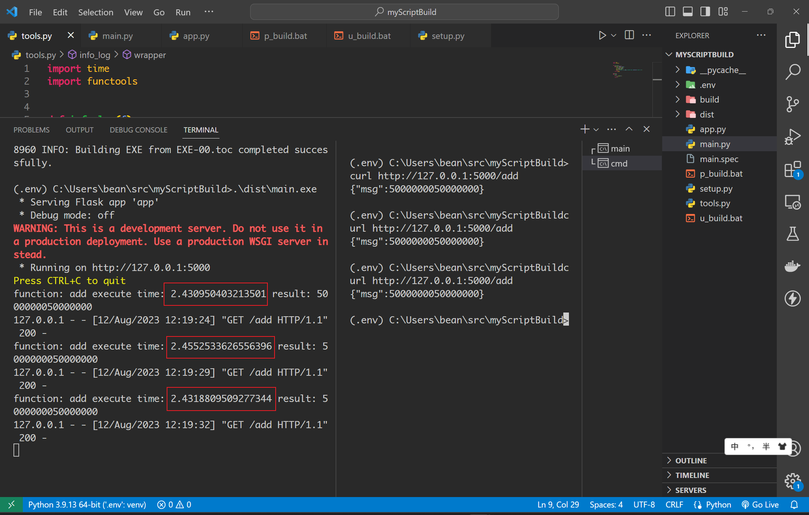
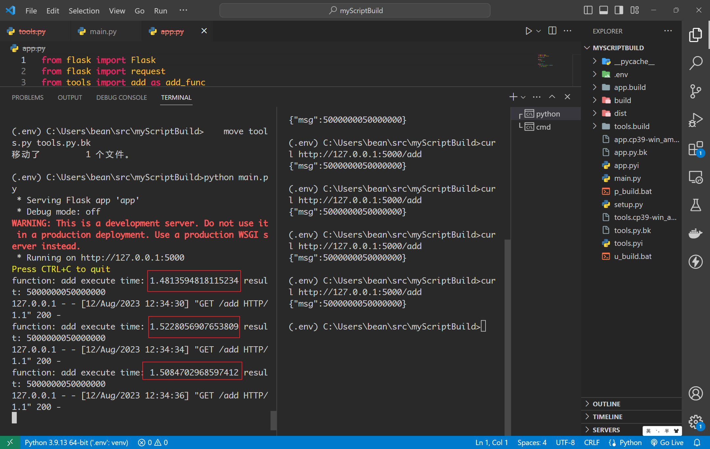
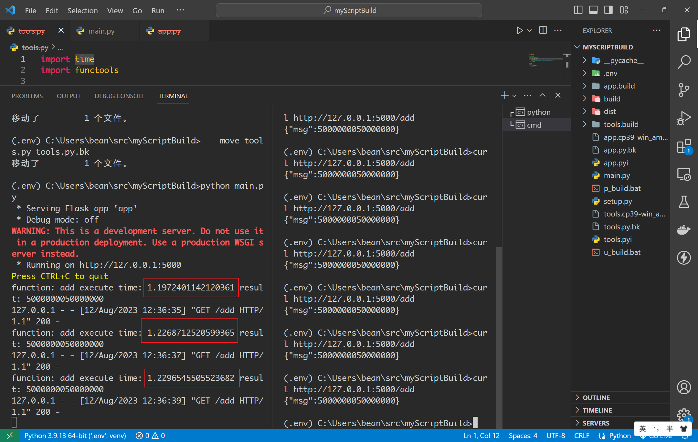
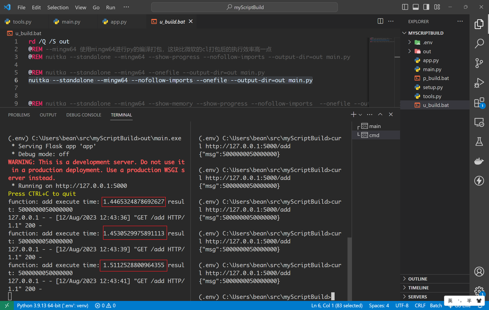
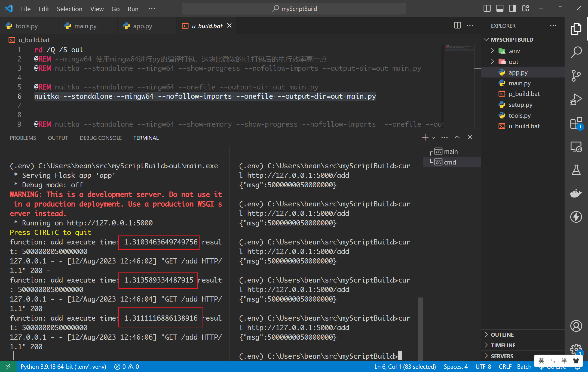
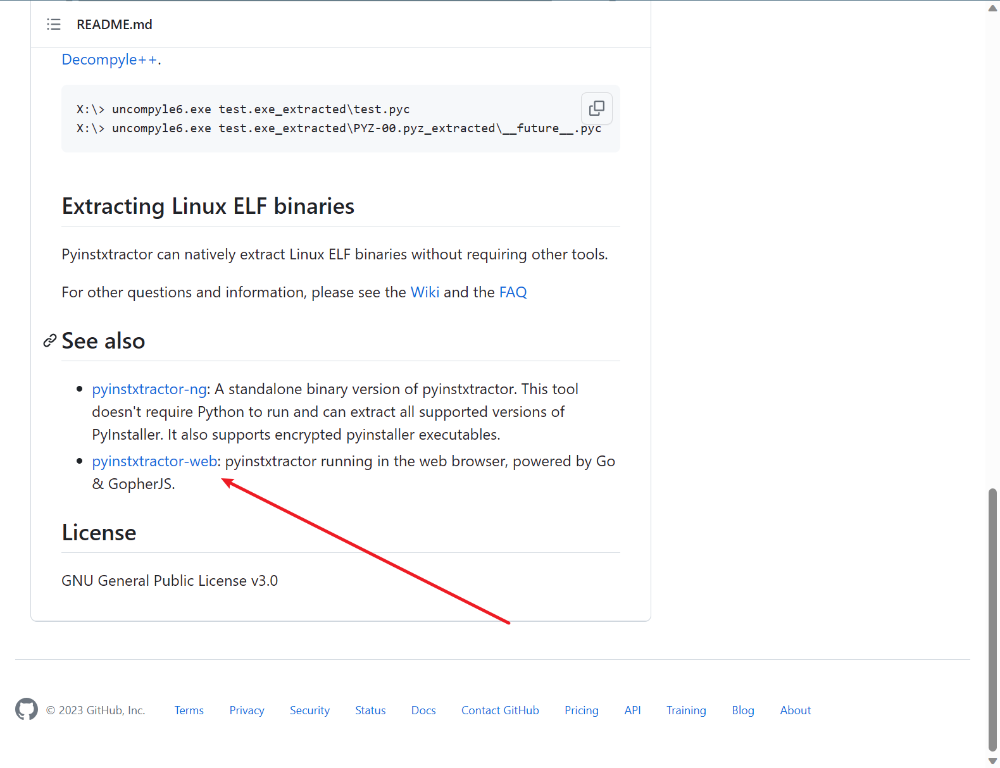

# Py脚本打包之后的效率对比

## 一、本次嘉宾

1. pyinstaller -> 支持打包成exe文件,直接执行

2. python + cython + MSVC  -> 将py代码转换为pyd,通过python执行pyd

3. python + nuitka + MSVC -> 将py代码转换为pyd,通过python执行pyd

4. python + nuitka + mingw64 -> 将py代码转换为pyd,通过python执行pyd

5. nuitka + MSVC -> 直接打包为exe,直接执行

6. nuitka + mingw64 -> 直接打包为exe,直接执行


## 二、相关测试代码

1. 文件目录树

    ```shell
    .
    ├── main.py
    ├── tools.py
    └── app.py
    ```

2. 源代码

    ```python
    # main.py
    from app import app


    if __name__ == "__main__":
        app.run()
    ```
    ```python
    # tools.py
    import time
    import functools


    def info_log(f):
        @functools.wraps(f)
        def wrapper(*args, **kwds):
            start = time.time()
            r = f(*args, **kwds)
            end = time.time()
            print(f"function: {f.__name__} execute time: {end-start} result: {r}")
            return r
        return wrapper


    @info_log
    def add(n):
        r = 0
        for i in range(n+1):
            r += i
        return r
    ```
    ```python
    # app.py
    from flask import Flask
    from flask import request
    from tools import add as add_func

    app = Flask(__name__)


    @app.get("/")
    def index():
        return {
            "msg": "pong"
        }


    @app.get("/add")
    def add():
        a = int(request.args.get("k", 100000000))
        return {
            "msg": add_func(a)
        }
    ```

## 三、开始测试

1. pyinstaller 上场

    ```shell
    # 打包
    pyinstaller -F main.py
    # 执行
    .\dist\main.exe
    # 测试
    curl http://127.0.0.1:5000/add
    ```

    三次测试结果如下：

    

    三次的执行时间都在`2.4s`左右


2. python + cython + MSVC 上场

    ```shell
    # 编辑打包文件setup.py
    # 执行编译
    python setup.py build_ext --inplace
    # 为避免导入源文件，我们将源文件重命名一下
    move app.py app.py.bk
    move tools.py tools.py.bk
    # 启动
    python main.py
    # 测试
    curl http://127.0.0.1:5000/add
    ```

    打包文件setup.py
    ```python
    from setuptools import setup

    from Cython.Build import cythonize

    filelist = ["app.py", "tools.py"]

    setup(ext_modules=cythonize(filelist,
                                language_level=3))
    ```

    三次测试结果如下：

    

    三次的执行时间都在`1.8s`左右

3. python + nuitka + MSVC

    ```shell
    # 执行编译
    nuitka --module --output-dir=. app.py
    nuitka --module --output-dir=. tools.py
    # 为避免导入源文件，我们将源文件重命名一下
    move app.py app.py.bk
    move tools.py tools.py.bk
    # 启动
    python main.py
    # 测试
    curl http://127.0.0.1:5000/add
    ```

    三次测试结果如下：

    

    三次的执行时间都在`1.5s`左右


4. python + nuitka + mingw64


    ```shell
    # 执行编译
    nuitka --mingw64 --module --output-dir=. app.py
    nuitka --mingw64 --module --output-dir=. tools.py
    # 为避免导入源文件，我们将源文件重命名一下
    move app.py app.py.bk
    move tools.py tools.py.bk
    # 启动
    python main.py
    # 测试
    curl http://127.0.0.1:5000/add
    ```

    三次测试结果如下：

    

    三次的执行时间都在`1.2s`左右

5. nuitka + MSVC (感官上 打包很慢)

    ```shell
    # 执行编译
    nuitka --standalone --onefile --output-dir=out main.py
    # 启动
    .\out\main.exe
    # 测试
    curl http://127.0.0.1:5000/add
    ```

    三次测试结果如下：

    

    三次的执行时间都在`1.4s`左右

6. nuitka + mingw64 (感官上 打包很慢)

    ```shell
    # 执行编译
    nuitka --standalone --mingw64 --onefile --output-dir=out main.py
    # 启动
    .\out\main.exe
    # 测试
    curl http://127.0.0.1:5000/add
    ```

    三次测试结果如下：

    

    三次的执行时间都在`1.3s`左右


## 四、直接看结论

1. pyinstaller                        ---->   `2.4s`
2. python + cython + MSVC             ---->   `1.8s`
3. python + nuitka + MSVC             ---->   `1.5s`
4. python + nuitka + mingw64          ---->   `1.2s`
5. nuitka + MSVC                      ---->   `1.4s`
6. nuitka + mingw64                   ---->   `1.3s`


上述结果做个简单总结：

若想要使用类似源码结构跑 -> 推荐`python + nuitka + mingw64`

若想要直接  ->  推荐`python + nuitka + mingw64`


## 五、安全性

1. pyinstaller不安全
    
    `pyinstxtractor`更新了，截止本稿，官方已经支持对`pyinstaller-5.12.0`的反编译了，虽然我使用的是最新的`5.13.0`,但是他还是可以反编译出来！并且官方的github上提供了web版的反编译工具！

    

    反编译后，浏览器会自动下载文件

    

    就比如我刚刚打包的文件，在这个反编译的压缩包`PYZ-00.pyz_extracted`目录下，找到`app.pyc` `tools.pyc`就可以反编码出对应的py脚本文件了

2. 其他几种会更安全么?

    虽然其他几种打包方式都是将源码进行py->pyd的操作，然后再进行不同程度的打包，但pyd内部构造会映射出来被py文件调用


## 六、参考文章

1. [pyinstaller](https://github.com/pyinstaller/pyinstaller)
2. [Nuitka](https://github.com/Nuitka/Nuitka)
3. [pyinstxtractor](https://github.com/extremecoders-re/pyinstxtractor)
4. [Nuitka打包exe-2023疑难杂症综合版](https://zhuanlan.zhihu.com/p/584899817)