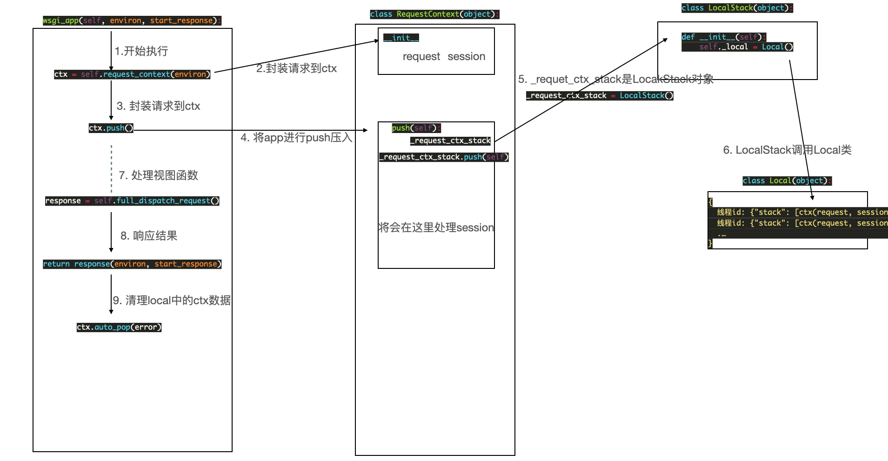

**注意点**：此源码源之于`flask 1.1.4`

### 一、Local类分析

1. threading.local类

​        当多线程操作同一公有资源时，如果涉及到修改该资源的操作，为了避免数据不同步可能导致的错误，需要使用互斥锁机制。但有时我们可以使用`threading.local`类实现数据的隔离， 如下：

```python
from threading import Thread, local
import time

l = local()

def task1(n):
    l.num = n
    time.sleep(2)
    print("处理后" ,l.num)


for i in range(10):
    t = Thread(target=task1, args=(i,))
    t.start()
```

2. 自定义local类

我们尝试动手自己实现一个类似的加强版`local`类，如下：

```python
# WebFrameDocs/src/flask/local.py

try:
    from greenlet import getcurrent as get_ident
except Exception as e:
    from threading import get_ident


class MyLocal():

    def __init__(self):
        super().__setattr__("storage", {})

    def __setattr__(self, name, value):
        id = get_ident()
        if id in self.storage:
            self.storage[id][name] = value
        else:
            self.storage[id] = {name: value}

    def __getattr__(self, name):
        id = get_ident()
        return self.storage[id][name]
```

3. 看下flask官方1.1.4版本的loca类

```python
try:
    from greenlet import getcurrent as get_ident
except ImportError:
    try:
        from thread import get_ident
    except ImportError:
        from _thread import get_ident


def release_local(local):
    """Releases the contents of the local for the current context.
    This makes it possible to use locals without a manager.

    Example::

        >>> loc = Local()
        >>> loc.foo = 42
        >>> release_local(loc)
        >>> hasattr(loc, 'foo')
        False

    With this function one can release :class:`Local` objects as well
    as :class:`LocalStack` objects.  However it is not possible to
    release data held by proxies that way, one always has to retain
    a reference to the underlying local object in order to be able
    to release it.

    .. versionadded:: 0.6.1
    """
    local.__release_local__()


class Local(object):
    __slots__ = ("__storage__", "__ident_func__")

    def __init__(self):
        object.__setattr__(self, "__storage__", {})
        object.__setattr__(self, "__ident_func__", get_ident)

    def __iter__(self):
        return iter(self.__storage__.items())

    def __call__(self, proxy):
        """Create a proxy for a name."""
        return LocalProxy(self, proxy)

    def __release_local__(self):
        self.__storage__.pop(self.__ident_func__(), None)

    def __getattr__(self, name):
        try:
            return self.__storage__[self.__ident_func__()][name]
        except KeyError:
            raise AttributeError(name)

    def __setattr__(self, name, value):
        ident = self.__ident_func__()
        storage = self.__storage__
        try:
            storage[ident][name] = value
        except KeyError:
            storage[ident] = {name: value}

    def __delattr__(self, name):
        try:
            del self.__storage__[self.__ident_func__()][name]
        except KeyError:
            raise AttributeError(name)
```


### 二、上下文简述

​        为了更进一步了解flask的工作流程，我们还是简单说下一个大致的工作过程。

​        首先是当我们运行我们的flask程序时，就是我们常常使用的`app.run()`，他将调用对应的run方法(代码如下)，我们关键看这个`run_simple(host, port, self, **options)`，在这里我们的self其实也是就`app`自己被传送到了`run_simple`当中，若是有心可以去看眼，对应的这个位置刚好就是`wsgi`协议中对应的`application`参数的位置，这也就是说，我们下一步的执行计划就是`application(environ, start_response)`，也就是`app(environ, start_response)`（这点不懂的同学需要补一下`wsgi`的知识点了），即`Flask`这个类的`__call__`方法，然后执行了`wsgi_app`（`__call__`中直接调用了）方法。

```python
# flask类中方法，节选

    def run(self, host=None, port=None, debug=None, load_dotenv=True, **options):
        
        from werkzeug.serving import run_simple

        try:
            run_simple(host, port, self, **options)
        finally:
            self._got_first_request = False
            
            
    def __call__(self, environ, start_response):
        return self.wsgi_app(environ, start_response)
      
      
    def wsgi_app(self, environ, start_response):
        ctx = self.request_context(environ)
        error = None
        try:
            try:
                ctx.push()
                response = self.full_dispatch_request()
            except Exception as e:
                error = e
                response = self.handle_exception(e)
            except:  # noqa: B001
                error = sys.exc_info()[1]
                raise
            return response(environ, start_response)
        finally:
            if self.should_ignore_error(error):
                error = None
            ctx.auto_pop(error)
```

其实有一点很有意思的东西哦~ 

```python
"""The actual WSGI application. This is not implemented in
:meth:`__call__` so that middlewares can be applied without
losing a reference to the app object. Instead of doing this::

    app = MyMiddleware(app)

It's a better idea to do this instead::

    app.wsgi_app = MyMiddleware(app.wsgi_app)

Then you still have the original application object around and
can continue to call methods on it.

.. versionchanged:: 0.7
    Teardown events for the request and app contexts are called
    even if an unhandled error occurs. Other events may not be
    called depending on when an error occurs during dispatch.
    See :ref:`callbacks-and-errors`.

:param environ: A WSGI environment.
:param start_response: A callable accepting a status code,
    a list of headers, and an optional exception context to
    start the response.
"""
```

​        这段文字来自于`wsgi_app`，告诉我们可以直接定制我们自己的中间件，很有趣的，后面可以考虑写一个demo。当然，我们通常使用`before_request`和`after_request`来做不是嘛，其实都是一样的，那么我们到底如何理解这个`wsgi_app`？这又和我们之前举例的`local`类有啥关系呢，另外这个东西和我们的`request`、`current_app`、`session`、`g`又有什么样的故事呢？请看下文。


### 三、`wsgi_app`执行过程

见源码分析：

```python
    def wsgi_app(self, environ, start_response):
                
        """
        ctx = RequestContent(self, environ)
            request
            session
        ctx 包含 request session
        """
        # 1. 数据封装
        ctx = self.request_context(environ)
        error = None
        try:
            try:
                """
                将数据压入堆栈,结构如下：
                {
                    线程id: {"stack": [ctx(request, session)]}
                }
                """
                # 2. 数据压入堆栈
                ctx.push()

                """
                找视图函数并执行
                """
                # 3. 执行视图函数
                response = self.full_dispatch_request()
            except Exception as e:
                error = e
                response = self.handle_exception(e)
            except:  # noqa: B001
                error = sys.exc_info()[1]
                raise

            # 4. 返回响应
            return response(environ, start_response)
        finally:
            if self.should_ignore_error(error):
                error = None

            # 5. 清理堆栈
            ctx.auto_pop(error)
```

图例：



通过上述表达我们可以理解，其实这部分是一个简单版的流程，那么更细致的流程内容呢？我将会对`request`、`current_app`、`session`、`g`进行更细的分析。

